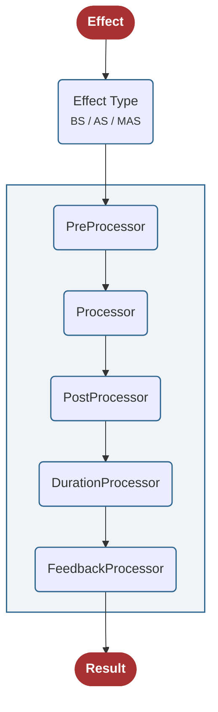
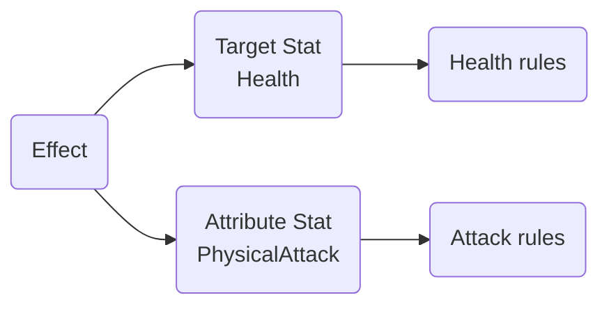
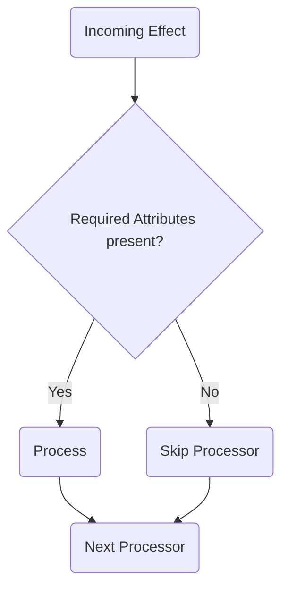
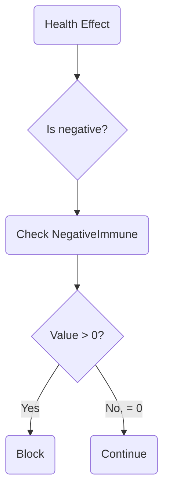
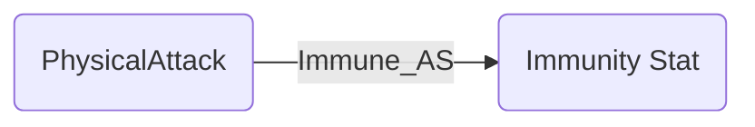
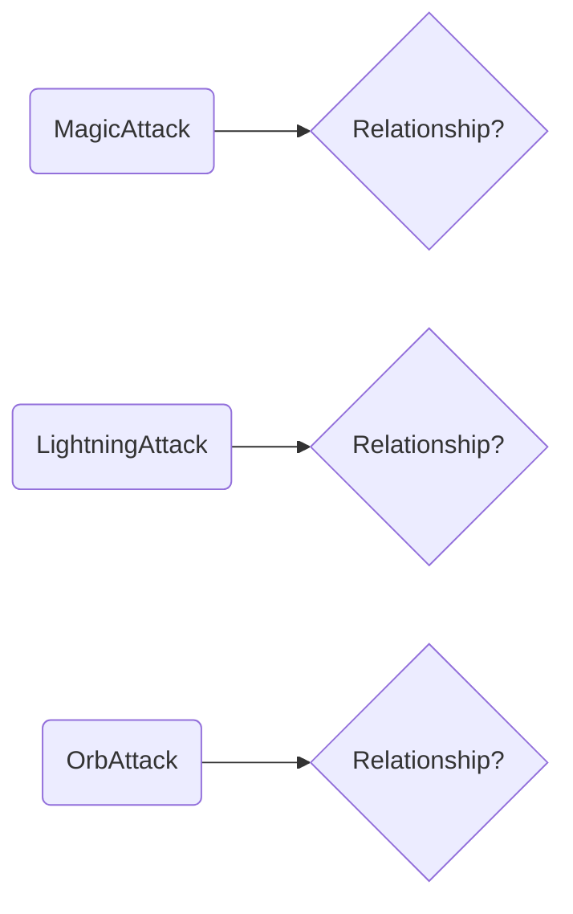
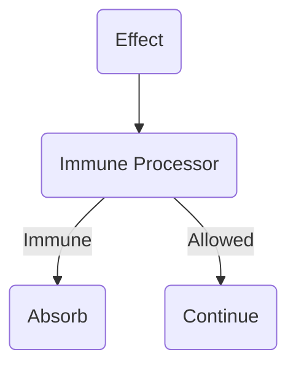

import EffectProcessDefinition from './images/EffectProcessDefinition.png';
import ProcessFunnel from './images/ProcessFunnel.png';
import EffectExample from '@site/src/components/EffectExample';

# Effect Process Flow

When an **Effect** is sent in Power, it does not modify a Stat directly.

Instead, it passes through a configurable **processing funnel** where multiple **Processors** can inspect, modify, block, or react to it.



Which processors participate — and what they do — depends on the Effect's:

* **Effect Type**
* **Attributes**
* **Target Stat**
* **Attribute Stats**
* **Stat Relationships**
* **Processor configuration**

This architecture allows Power to implement mechanics such as **immunity, counter effects, modifiers, limiters, critical hits, duration changes, and gameplay feedback** without hard-coding them into individual Effects.

---

## Effect Types

Power supports three Effect types. The difference between them is the number of **Attribute Stats** carried by the Effect.

| Effect Type                     | Target Stat | Attribute Stats |
| ------------------------------- | ----------- | --------------- |
| **Base Stat Effect**            | 1           | None            |
| **Attribute Stat Effect**       | 1           | 1               |
| **Multi Attribute Stat Effect** | 1           | Multiple        |

▶ [Video tutorial: Effect Types](https://youtu.be/0vtKy50Hpyo)

### Base Stat Effect

Contains only a **Target Stat** — useful when the Effect doesn't need an Attribute Stat to carry extra gameplay meaning.

<EffectExample targetStat="Health" value={-50} />

A simple 50-point reduction to Health.

### Attribute Stat Effect

Adds a single **Attribute Stat** on top of the Target Stat, giving the Effect additional gameplay meaning that Processors can key off of.

<EffectExample targetStat="Health" attributeStat="PhysicalAttack" value={-50} />

Processors can use relationships defined on `PhysicalAttack` to decide how to handle this Effect — for example, a target could be **immune to PhysicalAttack**.

### Multi Attribute Stat Effect

Carries **multiple** Attribute Stats at once, so a single Effect can represent several gameplay classifications simultaneously:

<EffectExample
  targetStat="Health"
  attributeStats={['MagicAttack', 'LightningAttack', 'OrbAttack']}
  value={-100}
/>

> A Lightning Orb that deals Magic damage.

Each classification participates in processing independently — an Effect doesn't have to belong to exactly one category.

---

## The Processing Funnel

Once sent, an Effect routes through the Processor funnel appropriate to its type.

▶ [Video tutorial: Processing Funnel](https://youtu.be/3yMrViborRs?list=PLAVxVgoBmZhM)

### Processor Selection

| Effect Type                  | Available Processors                                          |
| ----------------------------- | ------------------------------------------------------------- |
| **BaseStatEffect**           | BaseStatEffectProcessors                                      |
| **AttributeStatEffect**      | BaseStatEffectProcessors + AttributeStatEffectProcessors      |
| **MultiAttributeStatEffect** | BaseStatEffectProcessors + MultiAttributeStatEffectProcessors |

Consider:

<EffectExample targetStat="Health" attributeStat="PhysicalAttack" />

This Effect can be affected by two independent sets of rules:



* **Health** may be immune to negative Effects.
* **PhysicalAttack** may be blocked by Physical immunity.

Both rules get a chance to process the same Effect — that's why an Attribute Stat Effect passes through both processor sets.

---

## Effect Attributes

Every Processor shares the concept of **RequiredAttributes** — the Attributes it needs present on an Effect before it will run. If they're missing, the Processor is skipped and the funnel continues.



**Example:**

```text
Processor: BSPreprocess_Immune
RequiredAttributes: Immunable
```

An Effect carrying `Immunable` lets this Processor run; without it, the Processor is bypassed.

---

## Target Stat Processing

`BaseStatEffectProcessors` operate on the **Target Stat**, inspecting its relationships to decide how to handle the Effect.


Given:

<EffectExample targetStat="Health" value={-50} />

`BSPrecontributionProcess_Immune` uses `NegativeImmuneRelativeKey` / `PositiveImmuneRelativeKey` to pick which immunity Stat to evaluate — here, since the Effect is negative, it checks `ImmuneToNegativeHealthEffects`. If that Stat's value is greater than `0`, the Effect is blocked:



Health doesn't need to contain immunity logic itself — the relationship tells the Processor where to look, and the Processor decides what to do.

---

## Attribute Stat Processing

`AttributeStatEffectProcessors` operate on **Attribute Stats**. Given:

<EffectExample targetStat="Health" attributeStat="PhysicalAttack" />

`ASPrecontributionProcess_Immune` inspects `PhysicalAttack`'s relationships:



If the relationship exists and its value is greater than `0`, the Effect is absorbed. This lets a target express rules like:

```text
Immune to PhysicalAttack
Immune to FireAttack
Immune to SpearAttack
```

— without a separate hard-coded immunity system per gameplay type.

---

## Multi Attribute Processing

The same principle extends to **MultiAttributeStatEffects**: instead of one Attribute Stat, the Processor evaluates the full set carried by the Effect.

<EffectExample
  targetStat="Health"
  attributeStats={['MagicAttack', 'LightningAttack', 'OrbAttack']}
/>



Attribute Stats are composable — an Effect can carry multiple gameplay classifications at once rather than belonging to exactly one.

---

## Effect Process Definition

`EffectProcessDefinitionModel` defines the processing funnels used by Power, storing Processors in separate dictionaries per Effect type.


When an Effect arrives, Power resolves its Effect Type and routes it through the matching processing definition. The **ProcessorId** determines which funnel is used.

---

## Processor Stages

Within each funnel, Processors are divided into stages:


### PreProcessor

Runs before the Effect is applied — typically used for rules that decide whether the Effect should be blocked or continue: immunity, restrictions, direction, modifier count limits.



### Processor

Where the Effect is actually applied to the Target Stat — e.g. `Add_Float` calculates and applies the final value.

Standard processors have finer-grained control via **Contribution** and **PostContribution** stages, covering:

* Modifiers
* Critical Hits
* Damage Formulas
* Shields
* Limiters
* Reflection
* Offsets

### PostProcessor

Runs after the Effect has been applied, for rules that depend on the completed contribution — e.g. triggering a counter effect.

### Duration Processor

Modifies the **lifetime** of the resulting modifier rather than its value.

Used for mechanics like increasing buff duration or reducing debuff duration.

### Feedback Processor

Runs after processing completes, turning the result into gameplay feedback: floating damage/healing numbers, VFX, SFX, combat log messages, UI notifications, custom gameplay events.

---

## Putting It All Together

Power separates the Effect from the rules that process it:

* **Stats** store state.
* **Relationships** connect gameplay concepts.
* **Attributes** describe additional Effect context.
* **Processors** apply gameplay rules.
* **Feedback** communicates the result.

Together, these form the core of Power's Effect processing architecture.