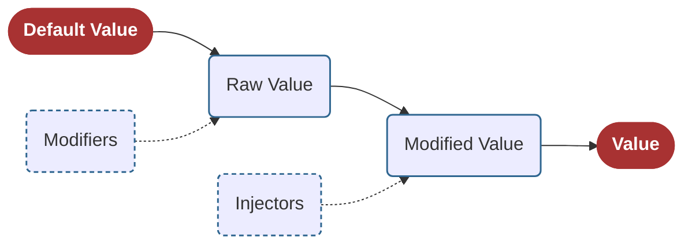
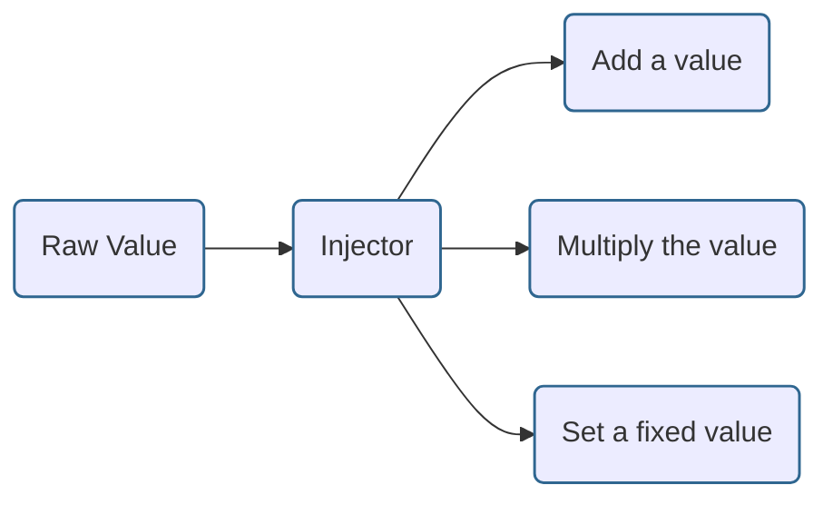
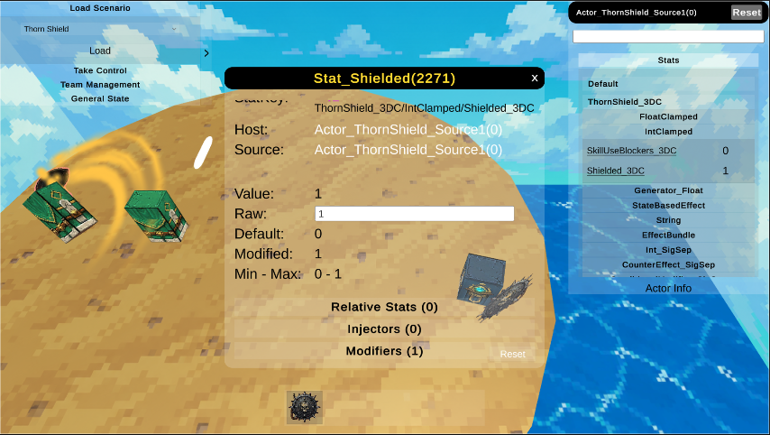

# How Stat Values Are Evaluated

Several elements contribute to a stat's final value.
Some of these come from the stat itself, such as whether it is clamped, while others come from **Modifiers** and **Injectors**.

**Modifiers**
- Modifiers are temporary values added to a stat.
- They can be removed over time or when a specific event is triggered.

**Injectors**

Injectors transform a stat's value according to their configuration.

For example, an Injector can:
- Add a value
- Multiply the value
- Set the value to a fixed amount
  
See more at the [Injectors](/docs/Assets/Misc/Injector/InjectorModel)

## Stat Values

To manage all of these contributions correctly, each stat stores multiple value parameters.

**Default Value**
  - The default value defined by the Stat Definition.
  - When a stat is created, it starts with this value.

**Raw Value**
  - The value after applying all permanent effects and modifiers.

**Modified Value**
  - Whenever the **Raw Value** changes, the **Modified Value** is recalculated.
  - It is produced by **applying all Injectors to the Raw Value**.

**Value**
  - This is the stat's final public value.
  - It is the value used for gameplay logic, calculations, and UI.
  - For most stats, **Value** is the same as **Modified Value**.
  - Some specialized stats behave differently. For example, a **Clamped Stat** returns the clamped version of **Modified Value** as its final **Value**.