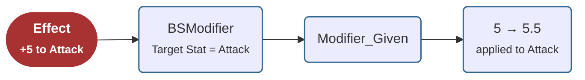
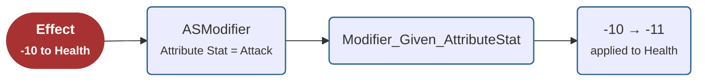

import EffectExample from '@site/src/components/EffectExample';

# Relative Stats for Target Stats and Attribute Stats

You can find a video tutorial [▶ here](https://youtu.be/0vtKy50Hpyo). 

A Stat can participate in an Effect in two different roles:

- As the **Target Stat**, whose value will be modified.
- As an **Attribute Stat**, whose value is used by a Processor while processing an Effect.

These two roles often require different Relative Stats.

For example, consider the following scenarios:

Now assume the **Attack** Stat has a **Modifier** Relative Stat that increases values by **10%**.

### 1. Attack Stat as the Target Stat

<EffectExample targetStat="Attack" value={5} />

The **BSModifier** Processor uses the Attack Stat as the **Target Stat**. It resolves the **Modifier_Given** Relative Stat and increases the incoming value from **5** to **5.5** before applying it to the Attack Stat.

### 2. Attack Stat as an Attribute Stat

<EffectExample targetStat="Health" attributeStat="Attack" value={-10} />

The target of the Effect is the enemy's **Health** Stat, while the **Attack** Stat is only used as an **Attribute Stat** during the **ASModifier** stage of the processing funnel to modify the Effect value. Since the Attack Stat also has a **Modifier** Relative Stat scoped to Attribute Stat usage, resolving **Modifier_Given_AttributeStat** correctly increases the outgoing damage from **-10** to **-11**.

**Modifier_Given** is scoped to direct Target Stat modification — it's the key **BSModifier** resolves in scenario 1. Reusing it here, in the Attribute Stat role, would be a mistake: since the Modifier is meant for Attack buffs, not for damage dealt using Attack, applying it via the wrong key would inflate the outgoing damage in a way that wasn't intended.

As shown in the samples, you will often see both **Modifier_Given** and **Modifier_Given_AttributeStat** Relative Keys.

- **Modifier_Given** is resolved by **BSModifier** when the Stat is used as the **Target Stat**.
- **Modifier_Given_AttributeStat** is resolved by **ASModifier** when the same Stat is used as an **Attribute Stat** to modify the Effect value.