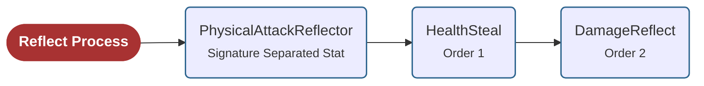

import SigSepStat from './images/SigSepStat.png'

# Signature Seperated Stats

You can find a video tutorial for Signature Seperated Stats [▶ here](https://youtu.be/NY9KD_TpAJg).

A **Signature Separated Stat** is a container Stat that holds multiple child Stats.

During the Effect processing flow, these child Stats are retrieved according to their configured processing order and processed by the corresponding **Signature Separated Processors**.

This allows multiple Stats to participate in the same processing stage while keeping each Stat's definition and behavior independent.

For example, suppose a **PhysicalAttack** Stat has two different reflection mechanics:

- **HealthSteal**, which restores a portion of the dealt damage as Health to the attacker.
- **DamageReflect**, a debuff that causes half of the dealt damage to be reflected back to the attacker.

Both mechanics must run during the **Reflect** process. However, **PhysicalAttack** can reference only a single Reflector Stat, and creating a separate Relative Stat for every Reflector is not a scalable solution.

A **Signature Separated Stat** solves this problem by grouping the required Reflector Stats under a single container. In this example, **HealthSteal** and **DamageReflect** can both be stored inside a **PhysicalAttackReflector** Signature Separated Stat. Each child Stat keeps its own independent definition, and the **Signature Separated Reflect Processors** execute them one by one according to their configured processing order.

## Fields

| Field | Description |
| --- | --- |
| **Signature Separated Stats** | The list of child Stats contained by this Signature Separated Stat. |
| **Stat Orders** | Defines the order in which the child Stats are processed during the Effect processing flow. |

## Using Signature Separated Stats

To use a Stat as a **Signature Separated Stat**, you must use the **SigSep** version of its primitive Stat type.

For example, if you want to use multiple **Reflector** Stats for a **PhysicalAttack** Stat, you should create a **SigSep_Float** Stat and add the **Reflector** Stat Definitions to its **Signature Separated Stats** list. The **SigSep_Float** Stat must also be placed in a **Container_SigSep_Float**.

The same rule applies to all Stat types. For example, if you want to use multiple **FloatLimiter** Stats together, create a **SigSep_Float** Stat, add the **Limiter** Stat Definitions to its **Signature Separated Stats** list, and place it in a **Container_SigSep_Float**.