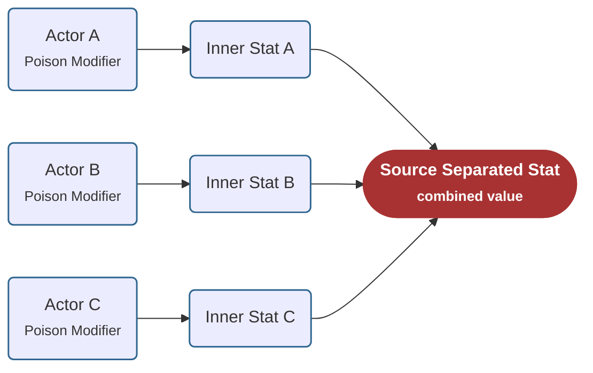
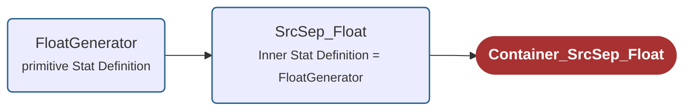

# Source Seperated Stats

You can find a video tutorial for Source Separated Stats [▶ here](https://youtu.be/SqY9eV1WYp8).

A **Source Separated Stat** is both a regular Stat and a container Stat.

In addition to maintaining its own value, it creates and manages a separate inner Stat for each source Actor that applies a Modifier. These inner Stats are created using the **Inner Stat Definition**.

Whenever a Modifier is applied to the Source Separated Stat, the Modifier is applied both to the Source Separated Stat itself and to the corresponding inner Stat of the source Actor.

This allows the Source Separated Stat to maintain its own total value while also keeping track of the individual contributions made by each source Actor.

For example, if three different Actors each apply a poison Modifier to the same target, the Source Separated Stat stores the combined poison value on itself while also maintaining three separate inner Stats—one for each source Actor. This enables mechanics that depend on individual sources, such as removing the poison from a specific attacker or redirecting only the damage contributed by a particular source.

## Fields

| Field | Description |
| --- | --- |
| **Inner Stat Definition** | Defines the Stat Definition used to create the per-source inner Stats. When values from different source Actors are received, they are stored in separate inner Stats created from this definition. |

## Using Source Separated Stats

To use a Stat as a **Source Separated Stat**, you must use the **SrcSep** version of its primitive Stat type.

For example, if you want to use a **FloatGenerator** as a Source Separated Stat, you should create a **SrcSep_Float** Stat and assign the **FloatGenerator** Stat Definition to its **Inner Stat Definition** field. The **SrcSep_Float** Stat must also be placed in a **Container_SrcSep_Float**.

The same rule applies to all Stat types. For example, **CounterEffect** uses the **EffectPack** primitive type. To use it as a Source Separated Stat, create a **SrcSep_EffectPack** Stat, assign the **CounterEffect** Stat Definition to its **Inner Stat Definition**, and place it in a **Container_SrcSep_EffectPack**.

