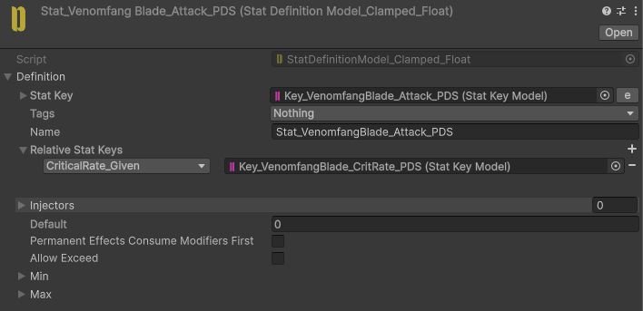
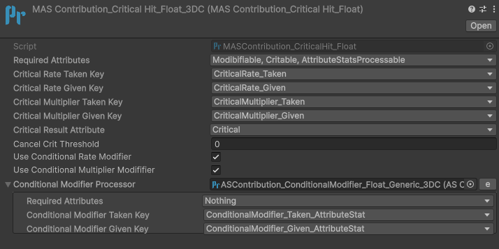
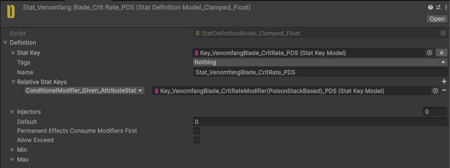
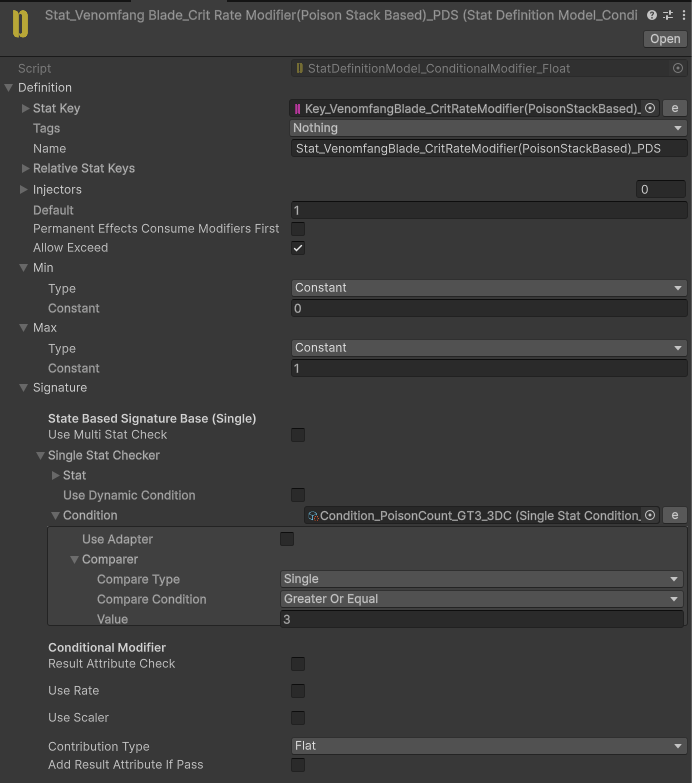

import FlowChain from '@site/src/components/FlowChain';

# Using Conditional Modifiers in Processors

Some Processors expose **UseConditionalModifier** options. These allow a Stat used by the Processor to be modified dynamically according to the current context before the Processor continues its execution.

## Why is this needed?

Consider the following requirement:

> **+50% Critical Rate against Undead enemies**

Normally, the **CritHit** process reads a single **CritRate** Stat, which has only one value. That makes it impossible to have different Critical Rate values depending on the current target or other runtime conditions.

By enabling **UseConditionalModifier**, the Processor first passes the **CritRate** Stat through a **Conditional Modifier**. The Conditional Modifier can then adjust the value according to any condition before the Processor uses it.

This mechanism is not limited to **CritRate**. It can be used for any Processor value such as **Hit Rate**, **Shield**, **Immune**, or any other Stat that supports conditional modification.

## How it works

Conditional Modifiers are always resolved through an **ASContribution_ConditionalModifier** Processor, regardless of which **UseConditionalModifier** option triggered them — its signature is the one that accepts both a **Target Stat** and an **Attribute Stat**.

For a Conditional Modifier, the Effect's real **Target Stat** is passed through as-is, while the queried Stat — the one whose value needs conditional adjustment, such as **CritRate** stat for the Crit process, or **HitRate** stat for the HitRate process — is passed in the **Attribute Stat** slot.

<FlowChain
  vertical
  columns={[
    [
      {icon: 'stat', label: "Effect's Target Stat"},
      {icon: 'stat', label: 'Queried Stat', sub: 'e.g. CritRate, HitRate'},
    ],
    {icon: 'processor', label: 'ASContribution_ConditionalModifier'},
    {label: 'Contribution', sub: 'Rate / Flat / Multiplier'},
    {label: 'Adjusted Value', sub: 'used for this execution only'},
  ]}
/>

The resulting Contribution is applied to the queried Stat's current value, and only for this Processor execution — the Stat's stored value is never permanently changed.

In other words, the Stat itself is conditionally modified only for the current Processor execution without permanently changing the Stat.

## Example Setup

We will use **VenomfangBlade** from the **3DCells** demo to demonstrate how Conditional Modifiers can be used with the **CritHit** Processor.

In the **VenomfangBlade** example, the Conditional Modifier is used to modify the critical hit chance based on the target's Poison stacks.

1. This is the VenomfangAttack Stat, which is used as an AttributeStat for VenomfangBlade attacks.

2. Enable **UseConditionalHitRateModifier** on the **CritHit** Processor.

3. Assign an **ASContribution_ConditionalModifier_Float** Processor reference.

4. On the **CritRate** Stat, assign the **ConditionalModifier_AttributeStat** Relative Stat that will be used during conditional processing.

5. When the Conditional Modifier's condition is met, the **CritRate** value will be modified. In this example, **1 is added to CritRate as a flat contribution**, allowing the blade to deal critical damage when the target has **3 or more Poison stacks**.

If you need multiple independent conditional modification rules, use a **Signature Separated** Conditional Modifier and its corresponding **Signature Separated Processor**.