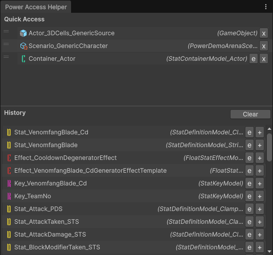

# Access

**Access** keeps the Power assets you work with one click away. Pin the assets you return to all the time in **Quick Access**, and find the ones you opened recently in **History**.

Open it from **Tools → Power → Access**.

## When to use it

- You are tuning one mechanic and keep switching between the same few assets: the Stat, its Effect, the Processor that reads it.
- You opened an asset a minute ago and lost it in the Project window.
- You want to drag the same asset into many fields (an Effect into several Packs, a Key into several Conditions).

## Quick Access

Drag any assets from the Project window into the **Quick Access** list, or press **+** on a row in History, [Search](./Search) or the Power Editor's asset list. Pins are saved per project in your editor preferences, so they survive restarts.

## History

History records the Power assets you focus and the ones you create, newest first, up to 40. A selected asset is recorded once it has stayed selected for a second, so clicking through the Project window doesn't fill the list. Press **Clear** to empty it.

Only Power assets are recorded: Repositories, Environments, Containers, Stats, Keys, Effects, Effect Packs, Processors, Process Definitions, Conditions, Scalers, Adapters, Distributers, Injectors, Linkers, Targeting Filters, Premade Relation Packs and the World, Diplomacy, Log and Updater settings.

## Rows

Every row works the same in both lists:

| Action | Does |
| --- | --- |
| Click | Pings the asset in the Project window. |
| Double-click | Opens the asset (its inspector, or its own editor). |
| Drag | Drops the asset into any object field or the Project window. Drag a row from History into Quick Access to pin it. |
| **e** | Opens the asset in the [Power Editor](./Editor). Hidden for assets the Power Editor doesn't show. |
| **r** | Opens the Stat (or the Stat a Key belongs to) in [Relations](./Relations). Shown only for Stats and Keys. |
| **+** | Pins the asset to Quick Access (History rows). |
| **x** | Unpins the asset (Quick Access rows). |

:::tip[Back to the last asset]

`Ctrl/Cmd + L` opens the newest History entry in the Power Editor, wherever you are. See [Shortcuts and Menu Items](./ShortcutsAndMenus).

:::
