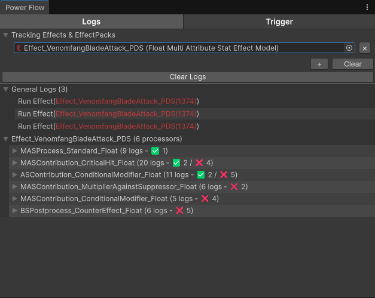
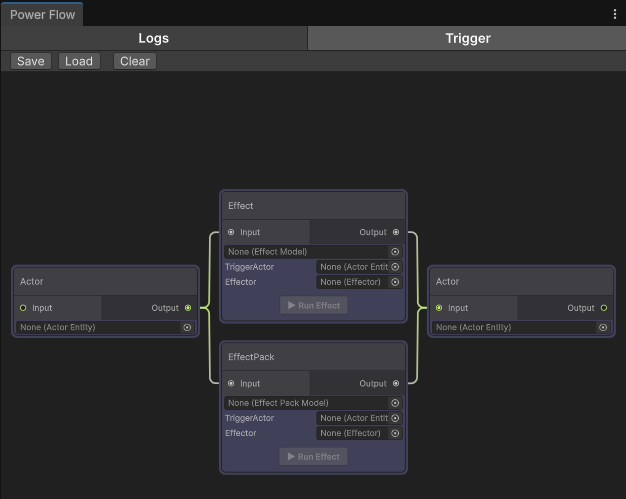

# Flow

**Power Flow** is a runtime debugging tool that helps you inspect how Effects are processed throughout Power's execution pipeline.

Although Power provides a comprehensive logging and log filtering system, there are times when you need to inspect the complete processing flow of a specific **Effect** or **EffectPack**. Power Flow collects all related logs and presents them in a single view, making it easier to understand which Processors were executed and what results they produced.

:::warning

Power Flow collects runtime logs. If the required log types are filtered out by **PowerLogSettings**, they will not be captured by Power Flow.

:::

## Trigger

The **Trigger** tab allows you to execute Effects directly from the editor.

This is useful when no gameplay mechanism exists to trigger an Effect yet, allowing you to inspect its behavior and verify the results without setting up a complete gameplay scenario.

:::note

The **Trigger** tab is only available during runtime because it operates on **Actors** that exist in the currently loaded scene.

:::

