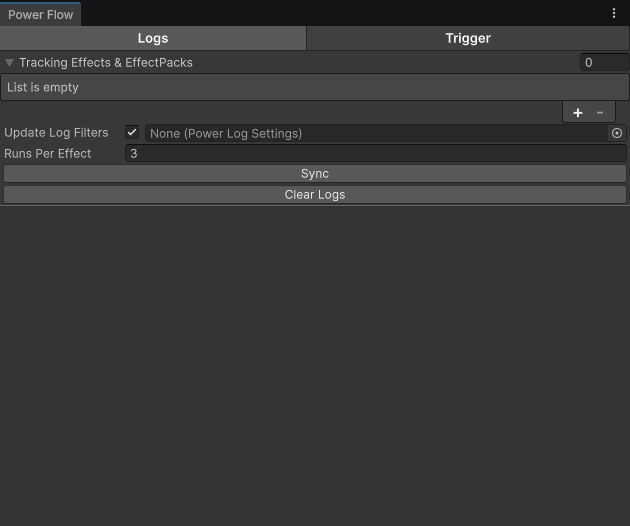
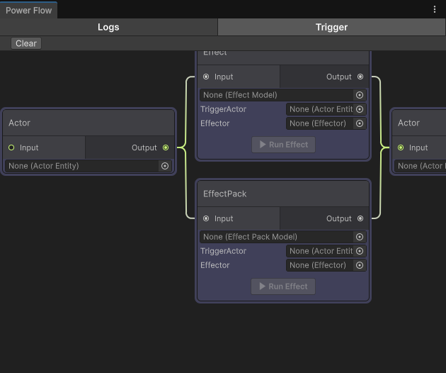

# Flow

**Power Flow** is a runtime debugging tool that helps you inspect how Effects are processed throughout Power's execution pipeline.

Although Power provides a comprehensive logging and log filtering system, there are times when you need to inspect the complete processing flow of a specific **Effect** or **EffectPack**. Power Flow collects all related logs and presents them in a single view, making it easier to understand which Processors were executed and what results they produced.

Open it from **Tools → Power → Flow**. To track Effects, select them (or Effect Packs) in the Project window and choose **Assets → Power → Add to Flow Tracking**.

:::warning

Power Flow collects runtime logs. If the required log types are filtered out by **PowerLogSettings**, they will not be captured by Power Flow.

:::

## Logs

Every tracked Effect (and every Effect of a tracked EffectPack) is listed, even before it runs. Each one keeps its latest runs, newest first. **Runs Per Effect** sets how many (default 3). A run is one application of the Effect on a target. When the same Effect starts again inside a run, for example as a counter effect, it gets its own run instead of mixing its logs into the first one.

A run shows only processor logs, grouped under phase titles in pipeline order: Preprocessors, Processor, Precontribution, Contribution, Postcontribution, Standard Postprocess, Postprocess, Duration Process, Feedback Process. Processor names are shown without their phase prefix (`Contribution_Armor` shows as `Armor`).

## Update Log Filters

Enable **Update Log Filters** next to the tracking list to make **Sync** point the log settings at the tracked Effects. On Sync it:

- turns on the **EffectFlow** and **Processors** log types,
- adds each tracked Effect (and every Effect of a tracked EffectPack) to the Effect filter list,
- adds each Effect's **TargetStat** and **AttributeStat** keys to the Stat filter list.

The **Filter Effects** and **Filter Stats** toggles are left as they are: the references are added anyway, so turning a filter on later already shows them. If a filter is a **BlackList**, the references are removed from it instead, so they aren't hidden.

The settings to update can be assigned next to the toggle. When it's empty, Power uses the installed settings in Play mode, else the open scene's **PowerWorld** settings.

## Trigger

The **Trigger** tab allows you to execute Effects directly from the editor. Open an Effect or Effect Pack in it with **Assets → Power → Open in Flow Trigger**, or an Actor with **GameObject → Power → Open in Flow Trigger** in the Hierarchy.

This is useful when no gameplay mechanism exists to trigger an Effect yet, allowing you to inspect its behavior and verify the results without setting up a complete gameplay scenario.

:::note

The **Trigger** tab is only available during runtime because it operates on **Actors** that exist in the currently loaded scene.

:::

