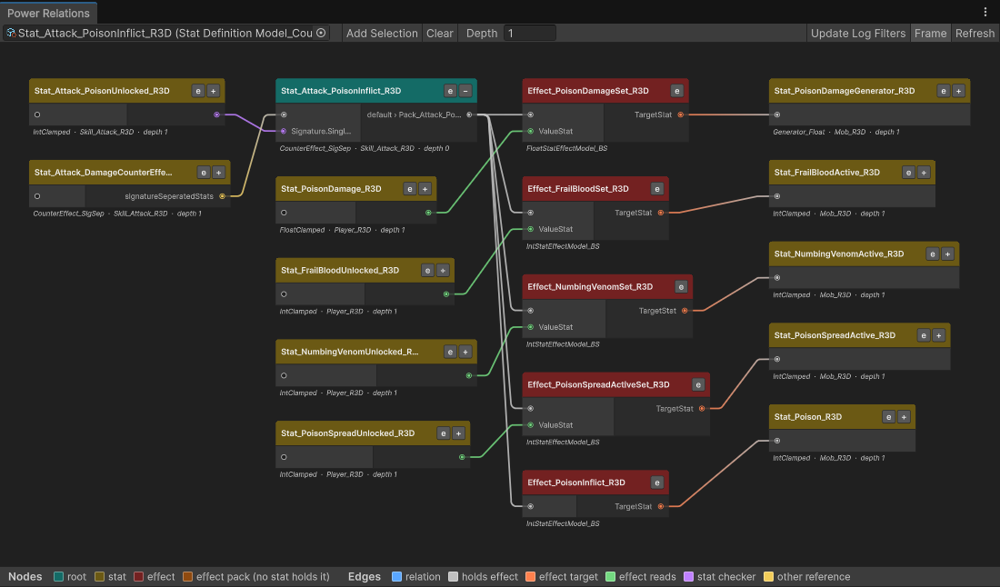

# Relations

**Relations** draws one or more Stats as a graph: the Stats and Effects that reference them, and the ones they reference. Use it to see a mechanic as a whole before you change it.

Open it from **Tools → Power → Relations** and pick a Stat Definition or a Stat Key in the toolbar field. You can also open it on a Stat directly:

- **Assets → Power → Show Relations** on one or more Stat Definitions or Stat Keys in the Project window,
- **Assets → Power → Add To Relations** to add the selected Stats to the graph already open,
- **Show Relations** in the ⋮ menu of a Stat Definition or Stat Key inspector, or the **Show Relations** button at the top of a Stat Definition inspector,
- the **r** button next to a Key field in any inspector, and on rows in [Access](./Access), [Search](./Search), [Validator](./Validator) and the Power Editor's asset list.

A Key opens the Stat that uses it. When several Stats use the same Key, the first one opens.

## Several Stats in one graph

A mechanic is usually more than one Stat. Show them together and the graph draws every root and what connects them:

| Control | Does |
| --- | --- |
| Toolbar field | Picks one root and replaces all others. |
| **Add Selection** | Adds the Stats (and the Stats of Keys) selected in the Project window as more roots. |
| **Clear** | Removes every root. |
| **+N more** | Shown next to the field when there are several roots; hover it for their names. |

Roots are placed like any other node: a root that an earlier root links to sits next to it, and only roots no earlier one reaches start a new stack in the first column. Effects, Packs and other assets can't be roots; they appear as nodes when a root reaches them.

## When to use it

- **What touches this Stat?** Every Effect that targets `Health`, every Stat related to it, every Condition that reads it.
- **What breaks if I change it?** Check what references a Stat before you delete, rename or convert it.
- **Why did this happen?** A value changed and you don't know which Effect or relation caused it.
- **Did my wiring land?** After you load a [Premade Relation Pack](/docs/Assets/Misc/PremadeRelationPack) or wire a relation, check that the links point where you expect. An AI agent can open its whole build here for you (`/build-mechanic --relations`, see [AI Support](/docs/AISupport#the-agent-workflow-optional)).
- **Debug one mechanic.** Select its nodes and press **Update Log Filters** to log only those Stats and Effects.

## Reading the graph

Nodes are Stats and Effects. Effect Packs, Injectors, Adapters and other assets in between are walked through, and their names appear in the link's label (`EffectPack › Pack_Fireball › effects`). An Effect Pack that no Stat holds gets a node of its own.

| Node | Color key |
| --- | --- |
| **Root** | A Stat you opened the graph for. |
| **Stat** | A Stat Definition. The subtitle shows its Container, Environment and how many Stats away it is. |
| **Effect** | An Effect. |
| **Effect pack** | An Effect Pack that no Stat holds. |

| Edge | Means |
| --- | --- |
| **Relation** | A relation on the Stat (Modifier, Conditional Modifier, Counter, Director…). |
| **Holds effect** | The Stat, Pack or other asset holds the Effect. |
| **Effect target** | The Effect's **Target Stat**. |
| **Effect reads** | The Effect reads the Stat (Value Stat, Duration Stat…). Drawn into the Effect, on a port named after the field. |
| **Stat checker** | A Condition on one Stat reads another Stat. Drawn into the Stat that holds the check. |
| **Other reference** | Any other reference. |

The legend under the graph shows the same colors. Who references an asset follows the Power Editor's **References** rules: an asset of another type that only names the Stat (an upgrade option, a scenario) isn't drawn.

## Depth and expanding

**Depth** sets how many Stats away from the roots are expanded. Effects between two Stats don't add a level, so at depth `1` you see the roots' Effects and the Stats beyond them.

Press **+** on a Stat node to load its relations, and **−** to hide them again, together with everything only they brought in. Nodes you expand by hand stay expanded after a domain reload.

## Working with nodes

| Action | Does |
| --- | --- |
| Select a node | Highlights it and everything one Stat away from it. |
| Double-click a node | Pings the asset in the Project window. |
| **e** on a node | Opens the asset in the [Power Editor](./Editor). |
| **Update Log Filters** | Adds the highlighted Stats to the active Log Settings' Stat filter and the highlighted Effects to the Effect filter, and turns on the matching log types. |
| **Frame** | Fits the whole graph in the view. |
| **Refresh** | Rescans the project's references and redraws. The graph also refreshes on its own when assets change. |
