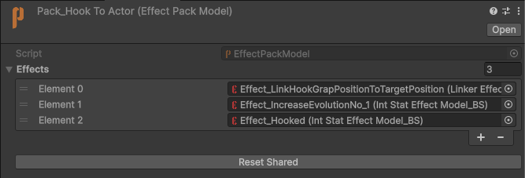
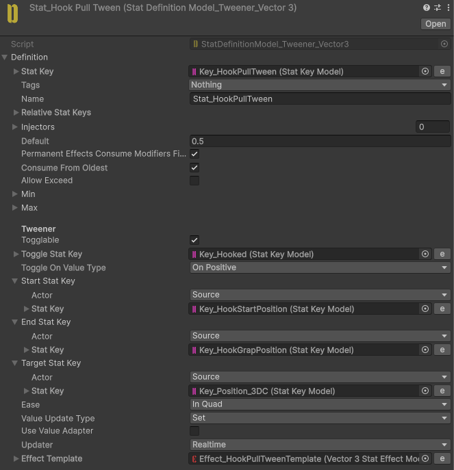
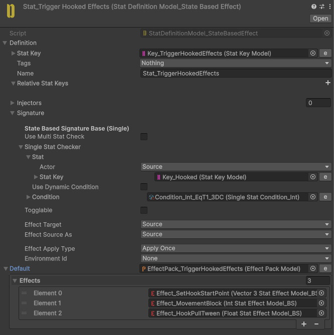
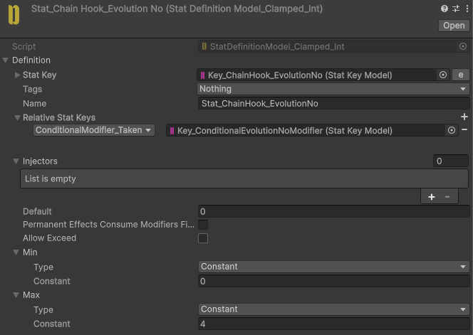
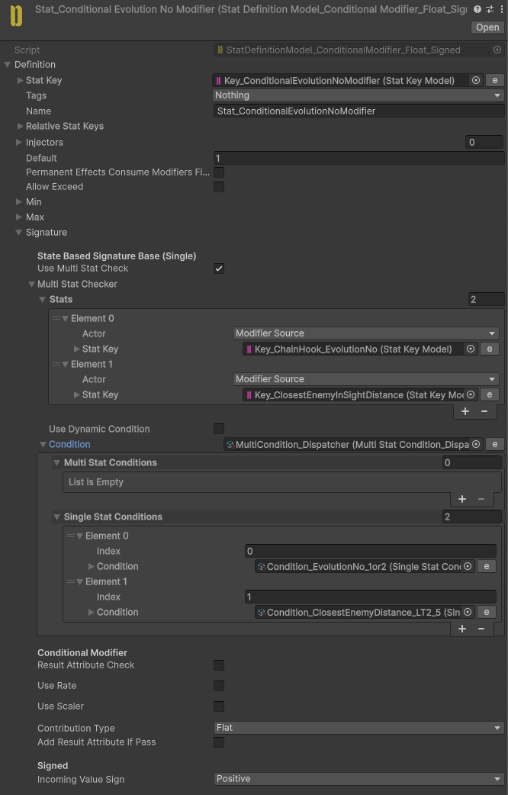
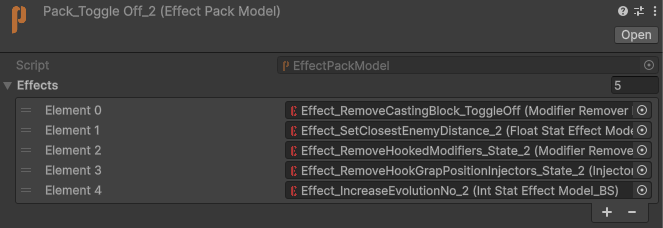
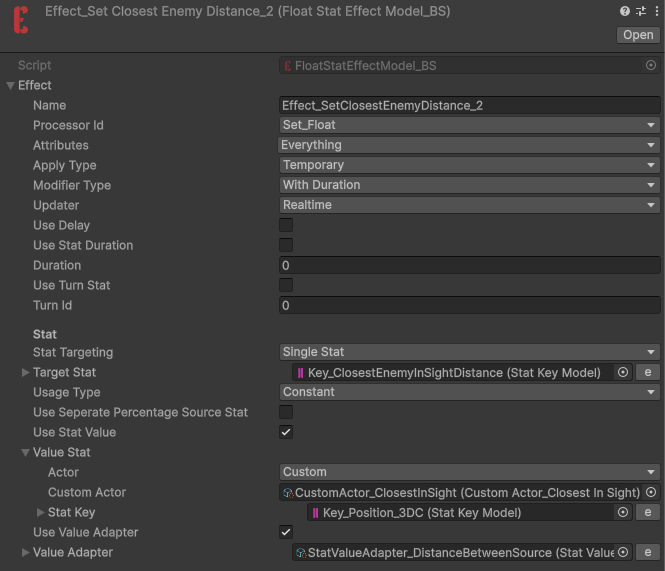

# Chain Hook

<video
  autoPlay
  loop
  muted
  playsInline
  controls={false}
  style={{
    width: "100%",
    borderRadius: "12px",
  }}
>
  <source src="/videos/ChainHook.mp4" type="video/mp4" />
</video>

Pulls the player toward enemies.

Pressing the attack button again after connecting performs either a **Punch** or a **Kick**, depending on the distance to the target.

**Punch** slightly knocks enemies back.

**Kick** launches enemies into the air, causing them to take fall damage when they land.

## Implementation

As you might expect, this is a multi-state skill with states such as **Hook**, **Pull**, **Kick**, and **Punch**.

When the Hook attack collides with an enemy, we use an Effect Pack to send the hook data to ourselves.

At the start of the pulling state, we use a **Linker** to copy the enemy's position to the **GrapPosition** Stat. This Stat is updated whenever the enemy moves.

The **Tweener** Stat then uses the **Start** and **GrapPosition** Stats to interpolate the player's position toward the enemy.

We also set the **Hooked** flag to `true`.

A **StateBasedTrigger** Stat listens for the **Hooked** flag and starts the pull tween when the flag is enabled.

We also have a **ConditionalModifier** assigned to **SkillEvolutionNo**.

This modifier checks the distance to the closest enemy and determines which state should be activated next.

If the distance check passes, the modifier adds the result to the incoming Effect value. This effectively skips the **Punch** state at index `3` and activates the **Kick** state at index `4`.

The closest enemy is set when we toggle off the **Pull** state by pressing the skill button again.

The closest enemy is then assigned using the following Effect:

