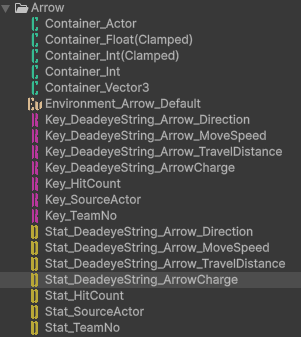
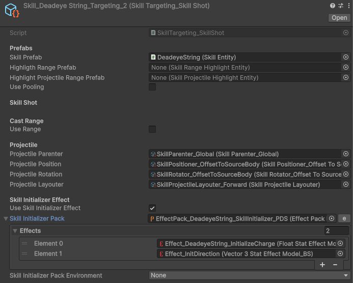
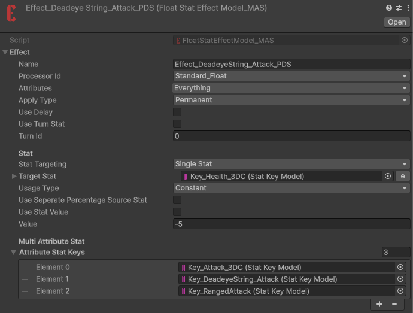
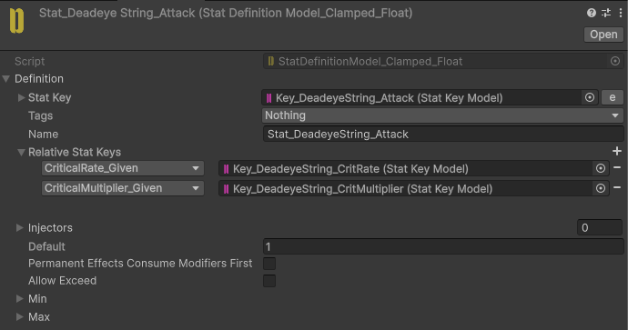
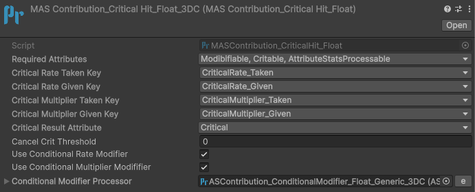
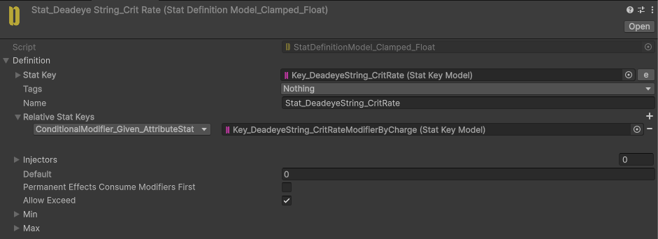
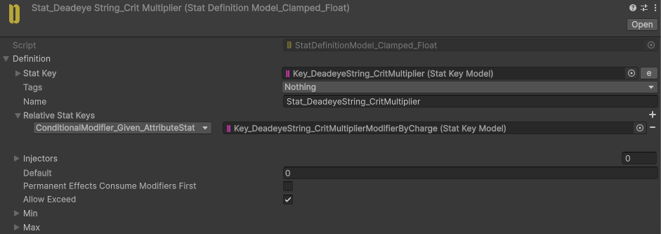
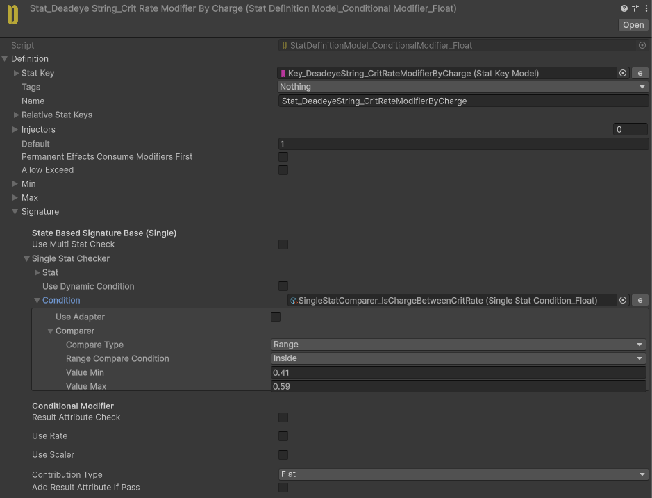
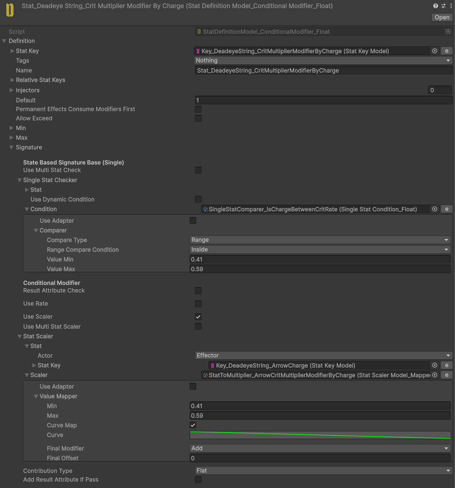

# Deadeye String

- Landing the shot within a specific timing window deals a critical hit.
- The critical damage multiplier depends on how accurately the shot is released within that window.

## Implementation

Our skill has two phases: charging and shooting.

We need to track the charge value during the charging phase. However, we cannot store this value directly on the Actor because multiple arrows can be fired in sequence. In that case, storing the charge value on the Actor could cause the charge values of different arrows to interfere with each other.

Therefore, we attach the charge value to each arrow. For this, we use ActorEntity for the arrow prefab, allowing us to store and access the charge value through the arrow's Stats.

The arrow also has other Stats for properties such as direction, speed, and distance.

Our Skill Targeter contains a SkillInitializer Effect Pack that applies the required initialization effects to the arrow's ActorEntity.

Now, let's see what the Deadeye String skill delivers to its target.

We use the DeadeyeString_Attack Stat to apply skill specific behaviors. Let's take a look at its configuration.

As you can see, we have skill specific CritRate and CritMultiplier Stats.

We want both of these values to change based on the arrow's charge value. Therefore, we enable UseConditionalModifier for both CritRate and CritMultiplier in the CritProcessor, allowing their values to be conditionally modified.

We also need to add ConditionalModifier_Given_AttributeStat relations to the CritRate and CritMultiplier Stats.

The CritRateModifier Stat adds 1 to CritRate as a flat contribution when the charge value is between 0.41 and 0.59.

The CritMultiplierModifier Stat scales the CritMultiplier value based on the charge value's closeness to 0.41.

