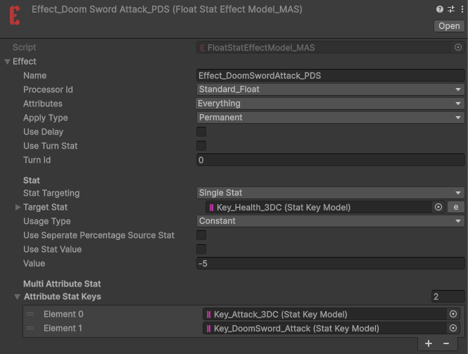
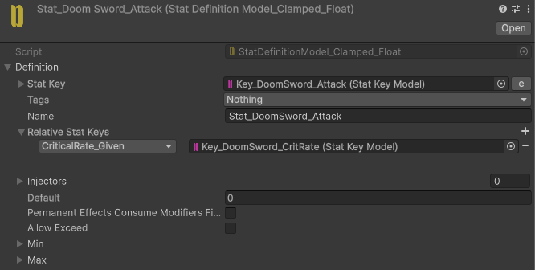
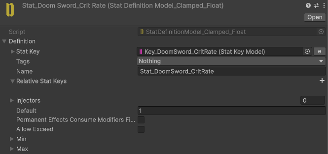
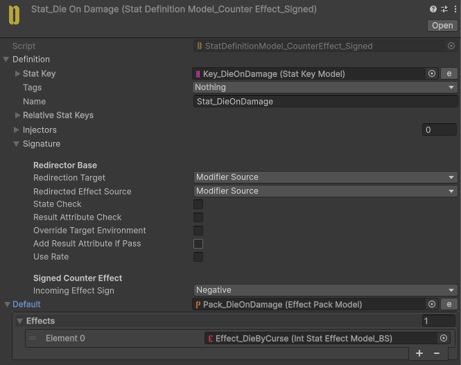
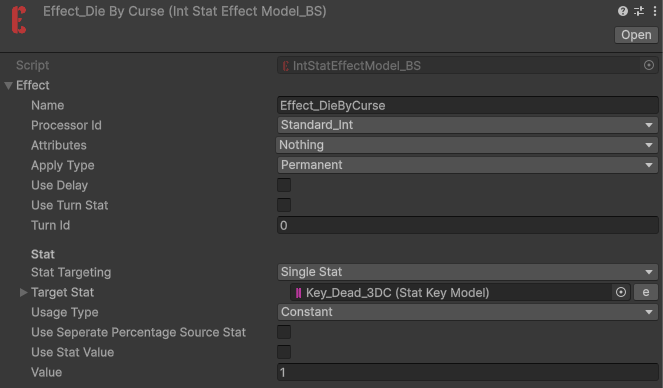

# Doom Sword

Every attack is a critical hit.

Taking any damage instantly kills the player.

## Implementation

We use **DoomSword_Attack** as the Effect Attribute Stat.

This Stat has a **CritRate** relation with a value of `1`.

Since the **CritProcessor** sums the **CritRate** and **CritMultiplier** values from all Attribute Stats, the CritRate reaches `1`, causing every attack to be a critical hit.

For the instant-death mechanic, we use a **CounterEffect** Stat injected into the **Health** Stat with negative Effect values being tracked.

When the player takes damage, the **CounterEffect** detects the negative Effect and triggers the die Effect.

