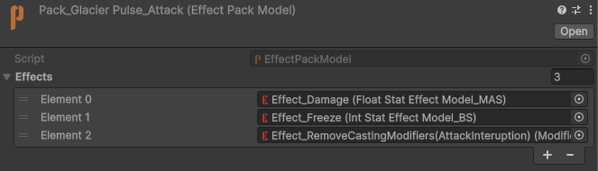
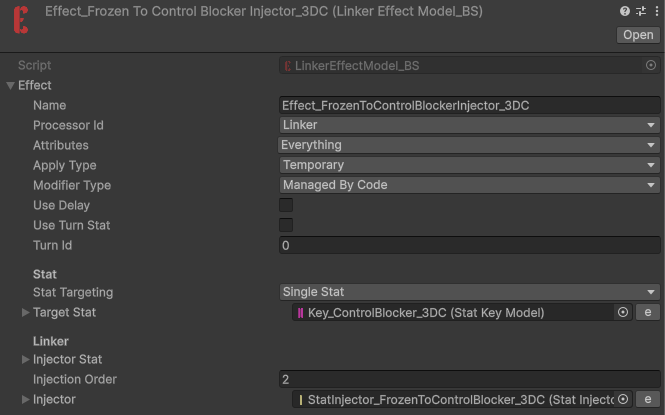
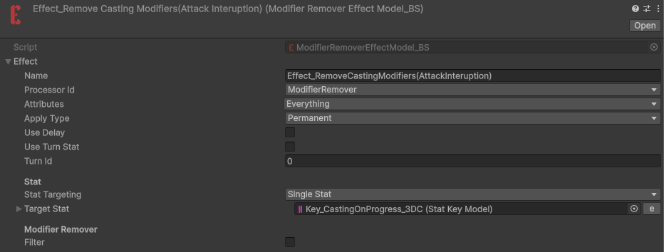
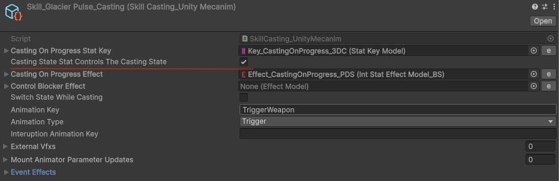
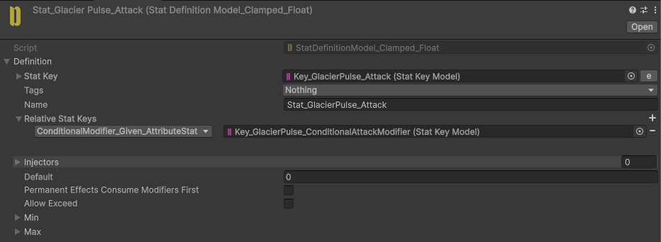
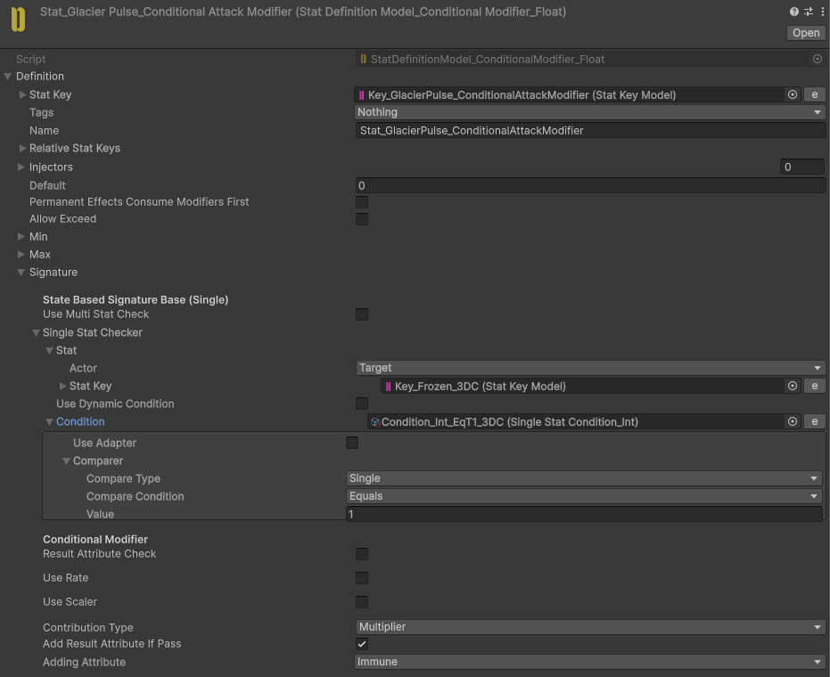
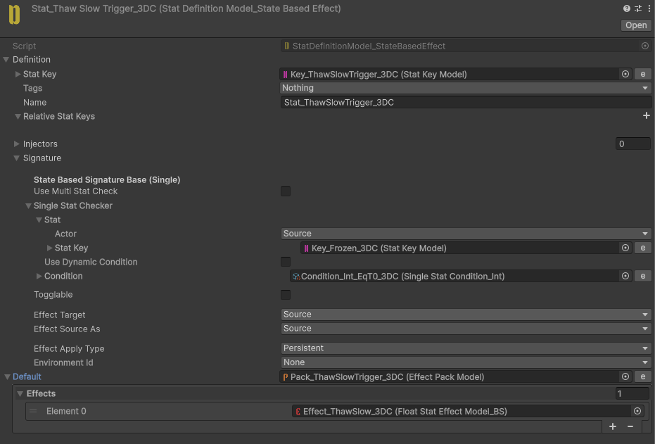
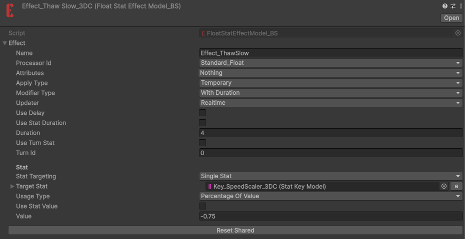

# Glacier Pulse

<video
  autoPlay
  loop
  muted
  playsInline
  controls={false}
  style={{
    width: "100%",
    borderRadius: "12px",
  }}
>
  <source src="/videos/GlacierPulse.mp4" type="video/mp4" />
</video>

Freezes enemies and deals a small amount of damage.

Already frozen enemies cannot be damaged by the freezing hit again.

When the freeze expires, enemies are slowed, reducing both their movement speed and attack speed.

## Implementation

This is the **GlacierPulse** attack Effect Pack.

The freeze attack targets the enemy's **Frozen** Stat.

The **Frozen** Stat also injects its value into **ControlBlocker**, which prevents the Actor from moving or attacking while frozen.

The **GlacierPulse** attack also cancels the enemy's ongoing attack by removing its **CastingOnProgress** Stat modifiers.

On the skill side, the skill casting state is tracked by the **CastingOnProgress** Stat. When its modifiers are removed externally, the Skill system can be configured to cancel the ongoing skill cast.

To prevent **GlacierPulse** from dealing damage when the target is already frozen, we use a **ConditionalModifier**.

The Conditional Modifier essentially multiplies the attack value by `0` and adds an **Immune** result attribute when the target is already frozen.

For the slow effect after the freeze expires, we use a **StateBasedEffect** to trigger the slow effects.

The slow effect targets the **SpeedScaler** Stat, which is used by both movement speed and animation speed.

