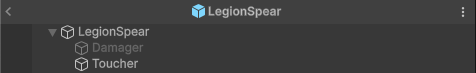
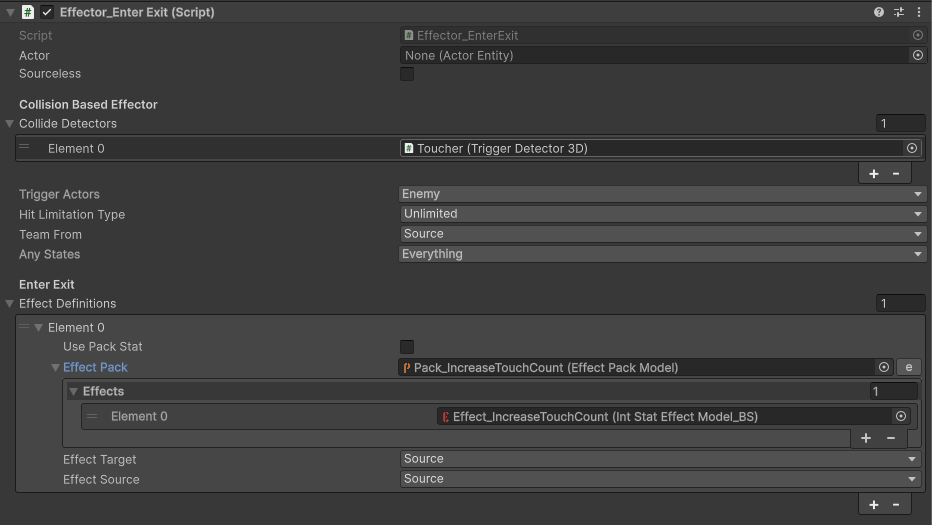
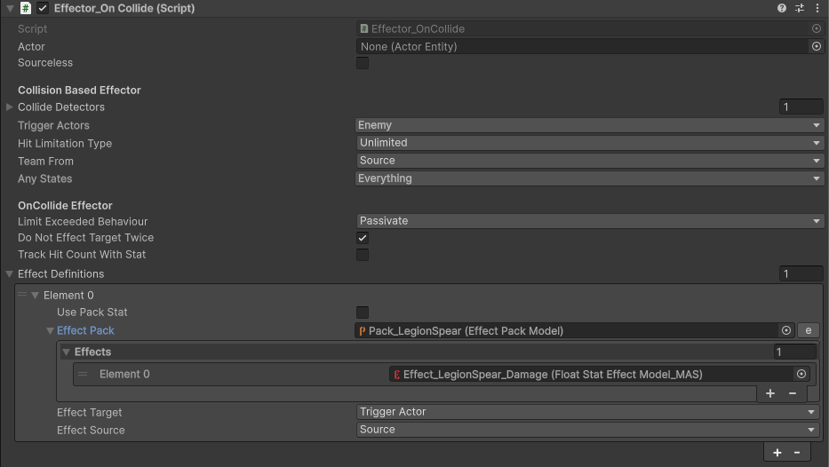
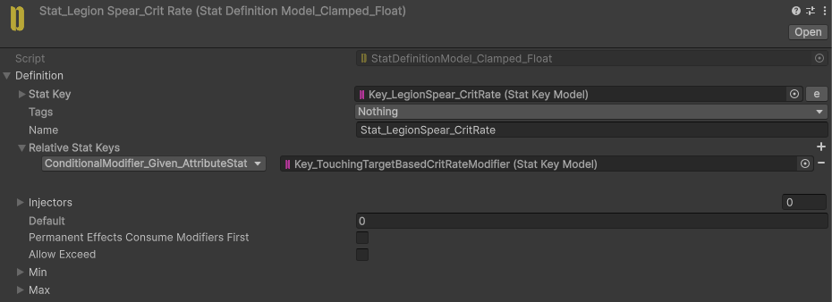
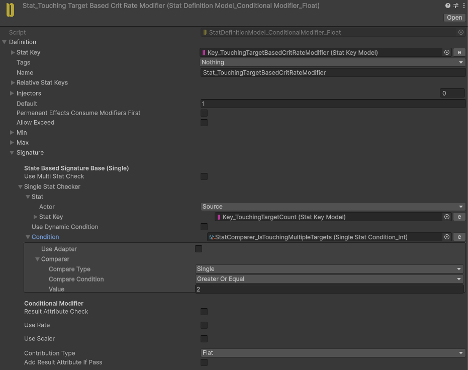
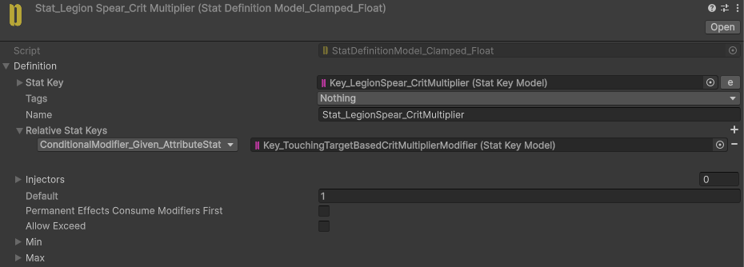
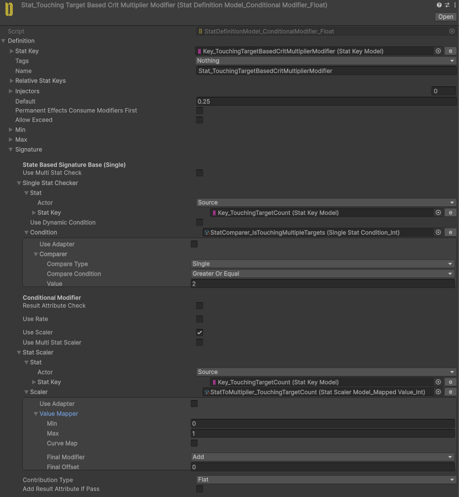

# Legion Spear

<video
  autoPlay
  loop
  muted
  playsInline
  controls={false}
  style={{
    width: "100%",
    borderRadius: "12px",
  }}
>
  <source src="/videos/LegionSpear.mp4" type="video/mp4" />
</video>

Deals a critical hit when a single attack hits multiple enemies.

The critical damage multiplier increases based on the number of enemies hit.

## Implementation

The **Legion Spear** skill object contains two Effectors.

The **Toucher** is initially active. Its **EnterExit** Effector increases the source Actor's **TouchCount** for each target inside the area.

The **Damage** Effector is activated after a `0.15` second delay. It uses an **OnCollide** Effector to apply damage to the **TriggerActors**.

To modify the **CritRate** and **CritMultiplier** values based on the number of touched targets, we use **ConditionalModifiers** with the **CritProcessor**.

The **CritRate** Conditional Modifier checks whether the **TouchCount** is greater than `1`. If the condition is met, it adds `1` to the **CritRate** as a flat contribution.

For the **CritMultiplier**, we use a **StatScaler** to scale the **CritMultiplierModifier** based on the number of touched targets. It adds `0.25` to the **CritMultiplier** for each target.

