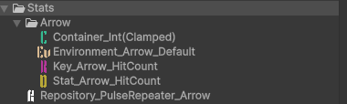
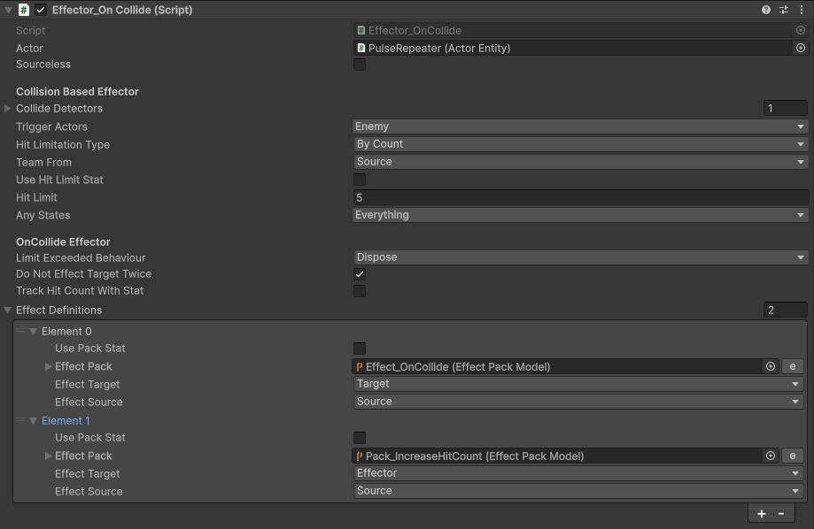
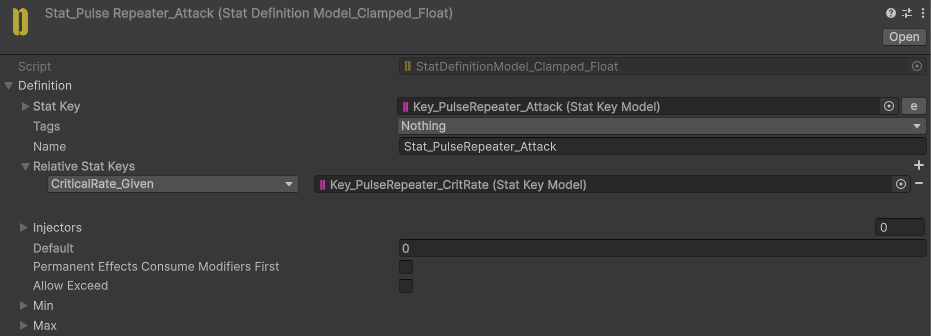
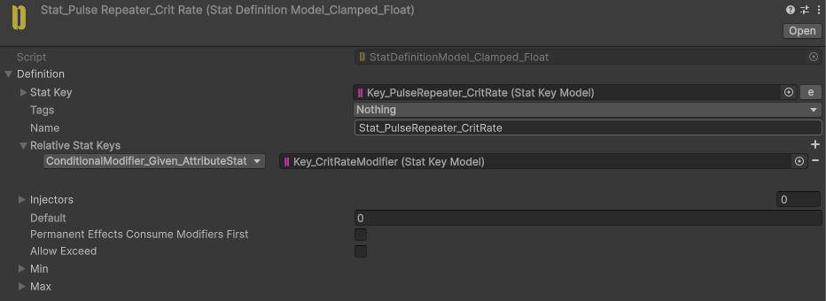
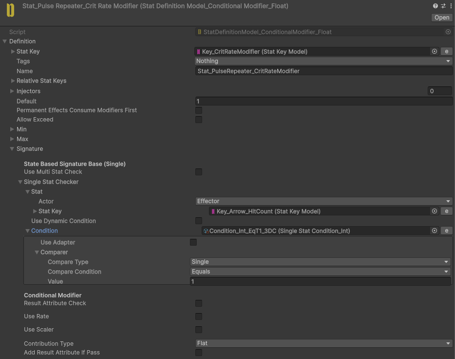

# Pulse Repeater

Projectiles pierce through enemies.

The first enemy standing behind the initial target receives critical damage.

## Implementation

We need to track the hit count to determine when to deal critical damage. However, the hit count cannot be stored on the source Actor, as this could cause the hit counts of different arrows to interfere with each other.

Therefore, we use **ActorEntity** for the arrow and add a **HitCount** Stat to it.

The Effector contains two Effect Definitions: one for damaging the enemy and another for increasing the arrow's **HitCount**.

To increase the **HitCount**, the **Target** option is set to the **Effector**, which is the arrow's **ActorEntity**.

The **PulseRepeater_Attack** Stat has its own **CritRate** Stat to define the conditions for modifying the critical hit chance.

To modify the **CritRate** value based on the hit count, we use **ConditionalModifiers** with the **CritProcessor**.

We can now modify the **CritRate** through the **CritRateModifier** Stat.

The **CritRateModifier** adds `1` to **CritRate** only when the arrow's **HitCount** is `1`.

