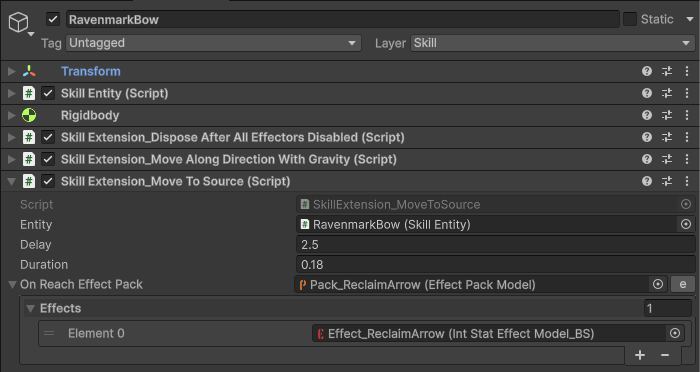
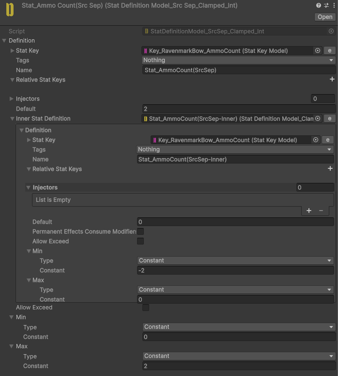
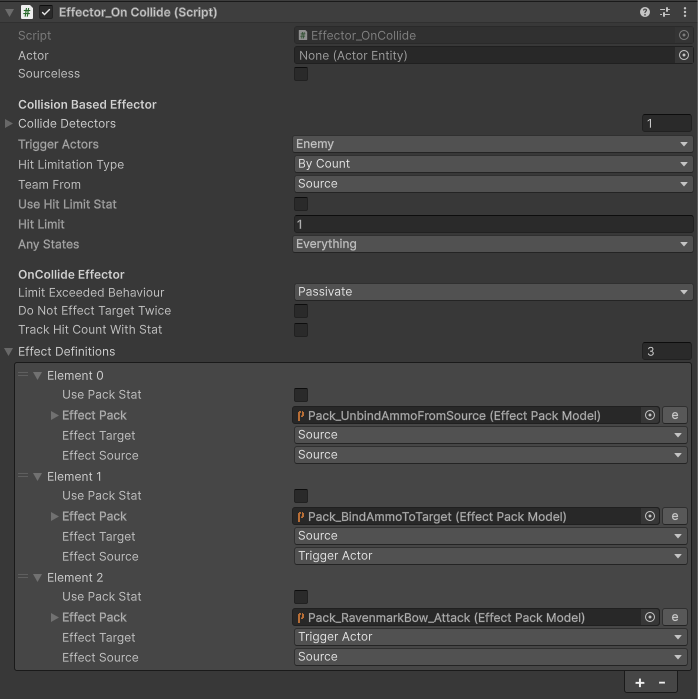
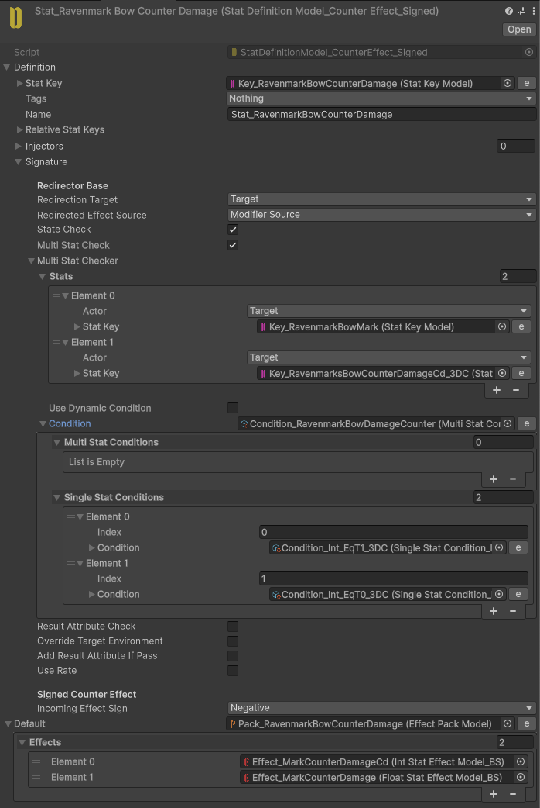
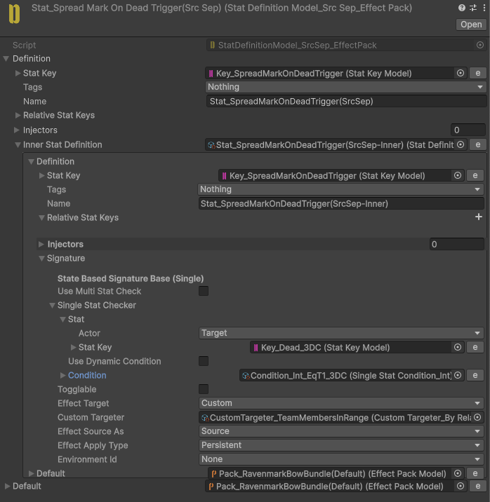
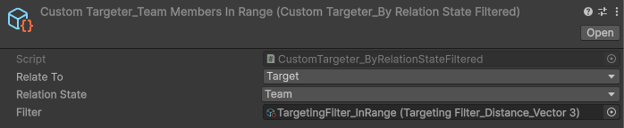

# Ravenmark Bow

<video
  autoPlay
  loop
  muted
  playsInline
  controls={false}
  style={{
    width: "100%",
    borderRadius: "12px",
  }}
>
  <source src="/videos/RavenmarkBow.mp4" type="video/mp4" />
</video>

Marks enemies for a short duration.

Marked enemies take additional damage whenever they are hit.

When a marked enemy dies, the mark spreads to nearby enemies.

## Implementation

**Ravenmark Bow** is one of the more complex implementations because we need to track arrows and which Actors they are currently attached to, while also keeping the ammo count consistent.

There are three scenarios for spending and reclaiming an arrow.

The first scenario is when we fire an arrow at the ground. In this case, we use a custom script to move the arrow back to its source and restore the ammo when the arrow reaches the source.

We use a **SourceSeparated Int Stat** for **AmmoCount**, while the inner Stats track the decrease amounts associated with each actor.

As shown below, the parent Stat has a range of `0` to `2`, while the inner Stat has a range of `-2` to `0`. Modifiers are added to both the inner Stat and the **SourceSeparated** parent Stat. This allows the system to track both the remaining ammo count and the decrease amounts associated with arrows for each Actor.

When an arrow is fired, its decrease amount is initially added to the source Actor's **SourceSeparated** Stat. If the arrow does not hit any target, this decrease amount remains assigned to the source Actor.

If the arrow hits a target, we remove the decrease amount from the source Actor and assign the same decrease amount to the target Actor. This allows the **SourceSeparated** Stat to track how many arrows are currently attached to each Actor.

Although this setup is somewhat complex, it works reliably and allows us to keep track of both the fired arrows and the remaining ammo.

To apply additional damage to marked targets, we use a **CounterEffect** that checks for the mark. After applying the damage, we add a cooldown to prevent the effect from triggering again immediately.

To spread the mark when a marked enemy dies, we use a **StateBasedEffect**. We also use a **SourceSeparated Stat** to ensure that the mark's source is correctly preserved when it spreads.

Finally, we use a **CustomTargeter** to find team members within the required range and apply the mark to them.

