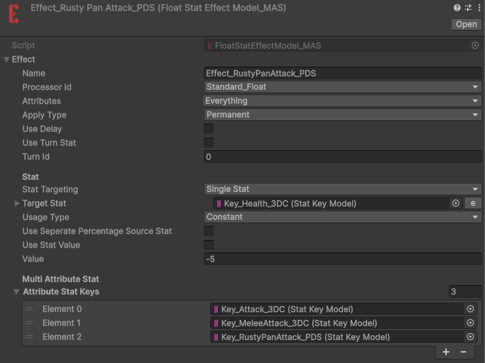
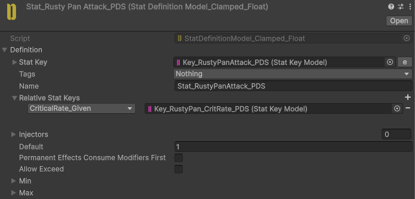
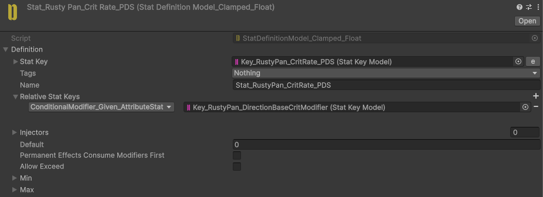
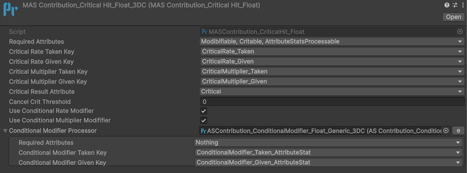
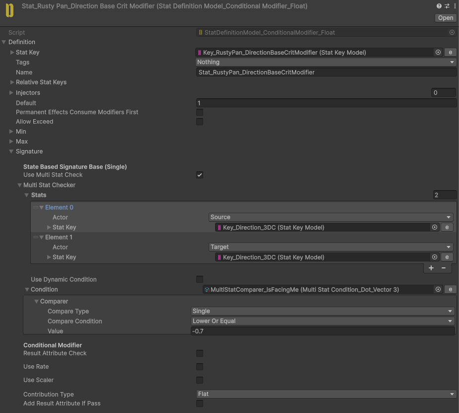

# Rusty Pan

<video
  autoPlay
  loop
  muted
  playsInline
  controls={false}
  style={{
    width: "100%",
    borderRadius: "12px",
  }}
>
  <source src="/videos/RustyPan.mp4" type="video/mp4" />
</video>

Deals critical damage to enemies that are facing the player.

## Implementation

We use the **RustyPan_Attack** Attribute Stat to apply skill-specific behaviors.

As you can see, we have a **CritRate** Stat attached to the **RustyPan_Attack** Stat.

By enabling **UseConditionalModifier** in the **CritProcessor**, we can conditionally modify the CritRate value based on the enemy's facing direction.

The **CritRateModifier** Stat adds `1` to **CritRate** as a flat contribution when the dot product between the enemy's forward direction and the source Actor's forward direction is below `-0.7`, indicating that the enemy is facing the player.