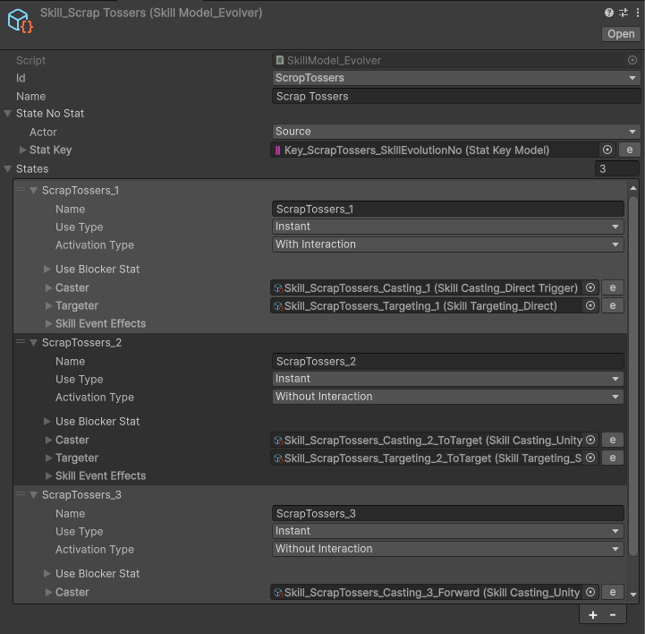
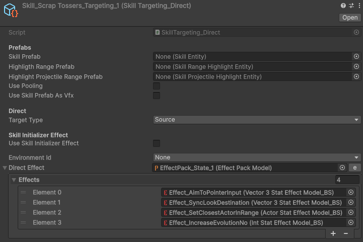
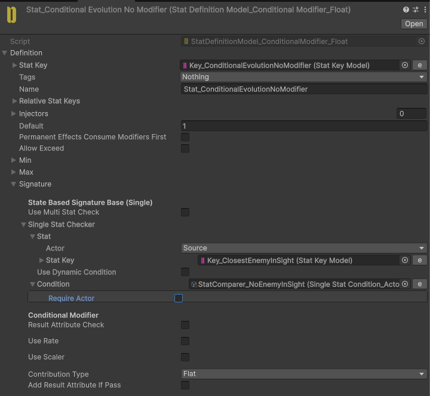
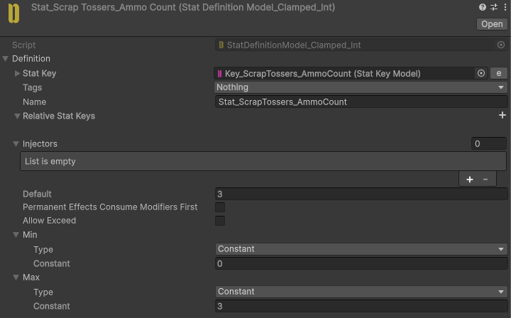
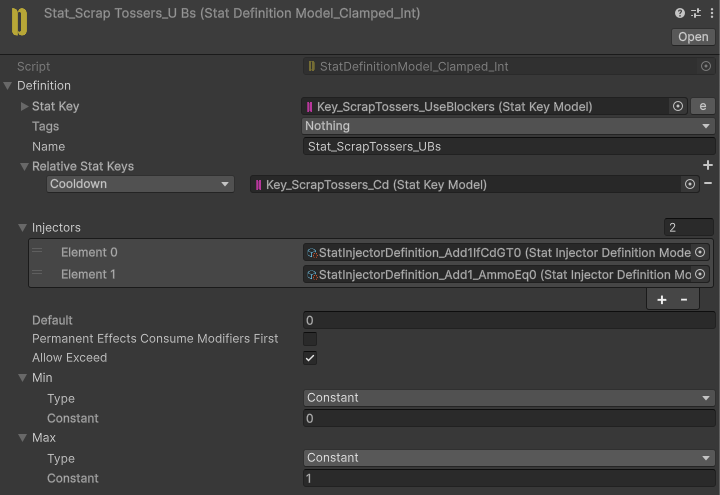
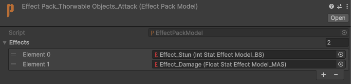
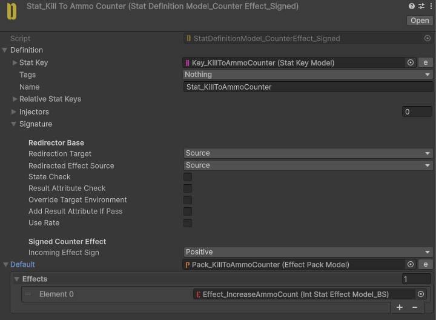

# Scrap Tossers

Holds up to **3 ammo**.

Stuns enemies on hit.

Restores **1 ammo** whenever an enemy is killed.

## Implementation

**Scrap Tossers** is a multi-state Skill. State 1 acquires a target, then either State 2 (a throw that homes toward that target) or State 3 (a straight forward throw) runs.

In State 1, `Effect_SetClosestActorInRange` writes the nearest valid enemy into the **ClosestEnemyInSight** Stat, using a `CustomActor_ClosestInSight` together with the `ClosestInSight`, `IsAlive`, and `Array` targeting filters. `Effect_IncreaseEvolutionNo` then advances the state.

`Stat_ConditionalEvolutionNoModifier` decides which throw follows. When a valid closest enemy was found it resolves to the homing throw (State 2, which uses `SkillRotator_ToActor`); otherwise it falls through to the forward throw (State 3).

### Ammo

Ammo is the **ScrapTossers_AmmoCount** Stat, clamped to `0`–`3` and defaulting to `3`. On each use, `Effect_SpendAmmo` applies `-1`.

To block the Skill while empty, `StatInjectorDefinition_Add1_AmmoEq0` injects `+1` into the Skill's **UseBlockers** Stat whenever **AmmoCount** equals `0` — the same pattern the cooldown uses. The Skill cannot be used again until ammo is available.

### Attack

`EffectPack_ThorwableObjects_Attack` applies two Effects on hit: `Effect_Damage` (a flat `-50` to **Health**) and `Effect_Stun`, which adds `1` to the target's **Stun** Stat for `2` seconds.

### Restoring ammo on kill

`Effect_KillToAmmoCounterInjector` injects a **CounterEffect** into the enemy's **CounterKillEffects** Stat through `Stat_KillToAmmoCounter`, tracking the lethal Effects dealt by this weapon. When an enemy dies, `Effect_IncreaseAmmoCount` adds `1` back to **AmmoCount**.

When the cast ends, `Effect_Cooldown` and `Effect_ResetEvolutionNo` reset the Skill for the next throw.
