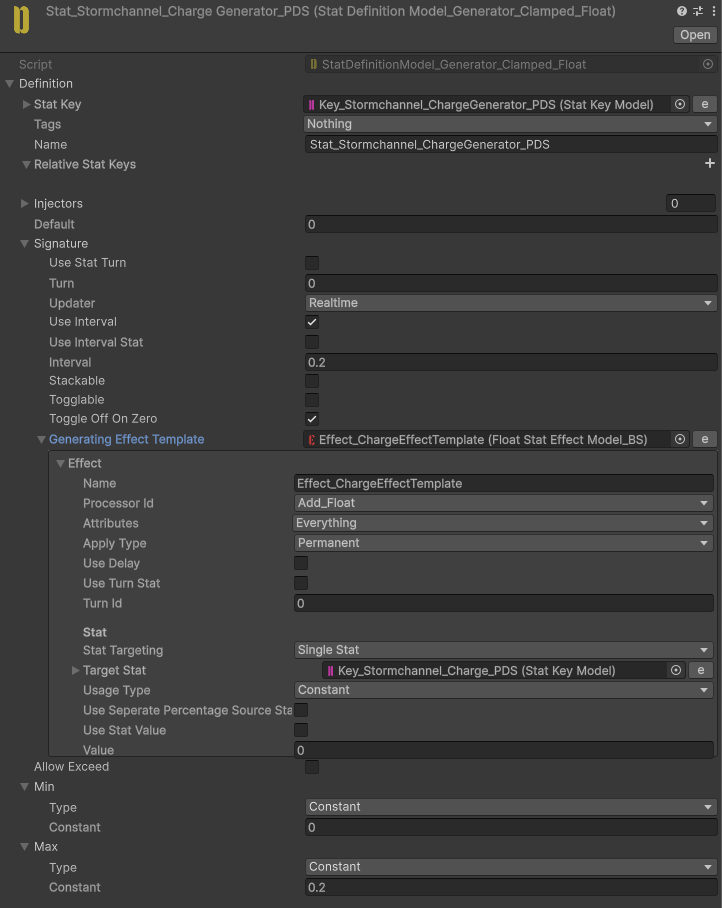
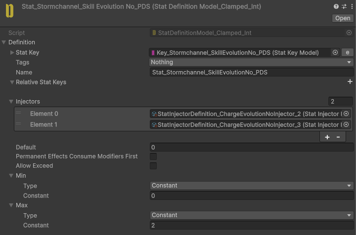
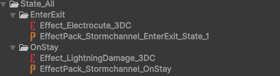
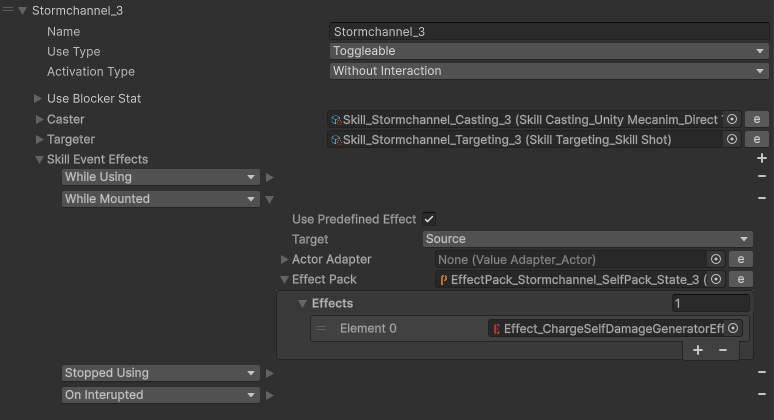
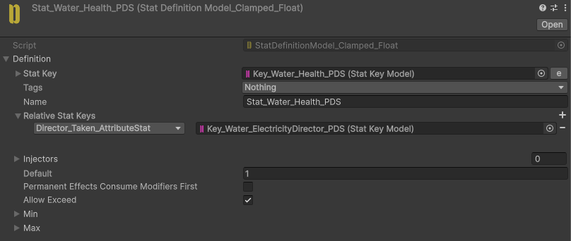
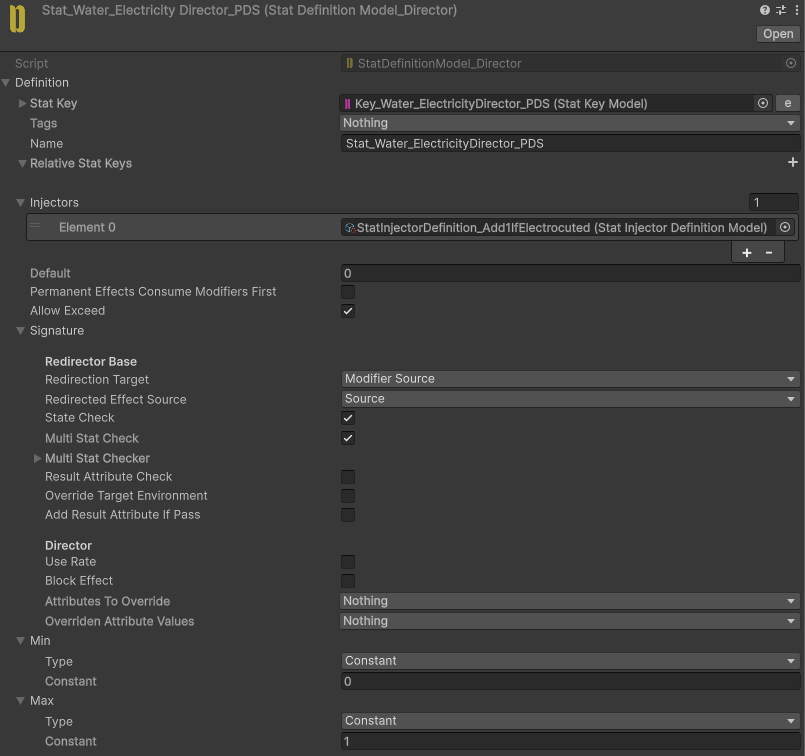
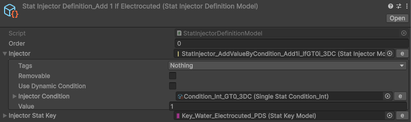

# Stormchannel

Fires a continuous lightning attack while the input is held.

Charges over time and changes Skill State as the charge increases.

Consists of **3 States**. Critical hits begin in the second State, and remaining in the third State causes the player to take self-damage.

## Implementation

**Stormchannel** is a toggle Skill. While the input is held, a **ChargeGenerator** Stat continuously raises a **Charge** Stat over time, while `Effect_AimActivation` enables aiming and `Effect_MovementBlock` locks the player in place.

The Skill's **SkillEvolutionNo** is driven by the **Charge** value through `StatInjector` definitions. When **Charge** reaches `1`, the Skill advances to State 2; when it reaches `2.2`, it advances to State 3.

The lightning itself is an `OnStay` Effector that applies `Effect_LightningDamage` (a flat `-2` to **Health**) and `Effect_Electrocute` to every Actor inside the beam each tick.

For critical hits, the **Stormchannel_AttackCritModifierByCharge** Stat conditionally modifies **CritRate** and **CritMultiplier** through the **CritProcessor**, based on the current **Charge**. This enables critical hits once the Skill has reached the second State.

While in the third State, a **ChargeSelfDamageGenerator** Stat generates recurring negative **Health** Effects on the source Actor, so holding the attack too long becomes dangerous.

When the Skill is interrupted or toggled off, `Effect_ResetCharge`, `Effect_Stormchannel_ZeroCharge`, and `Effect_Stormchannel_ZeroEvolutionNo` reset the state, and `Effect_Stormchannel_Cooldown` applies the cooldown.

### Water interaction

Water Actors use their own **Repository_Water** Stats. When the beam touches water, its **Electrocuted** Stat is raised, and `StatInjectorDefinition_AddElectrictyReflectorIfElectrocuted` adds an electricity director so the current spreads through connected water via `Effect_Stormchannel_Water_ElectricityDirector`. The `ElectrucedAnimation` script tints electrified water.

