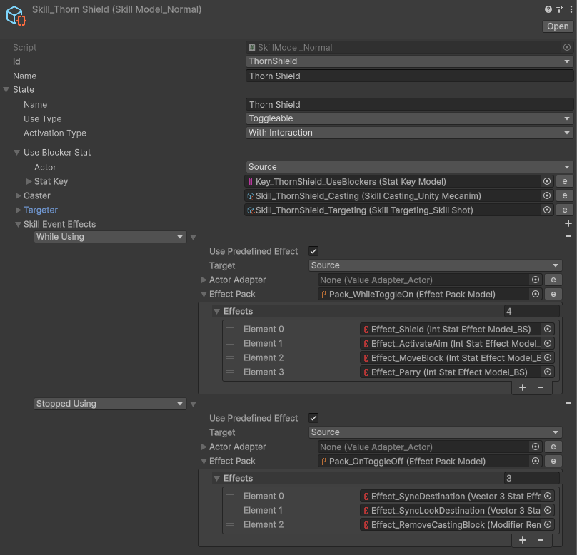
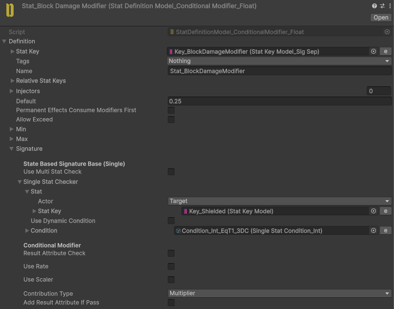
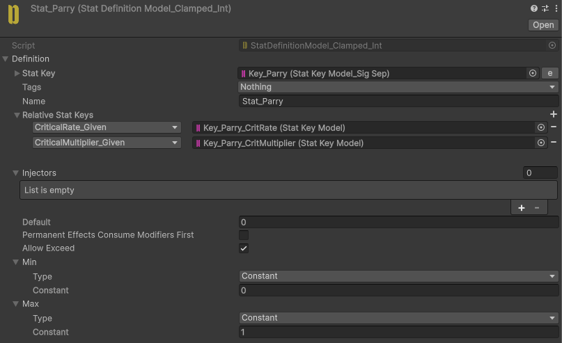
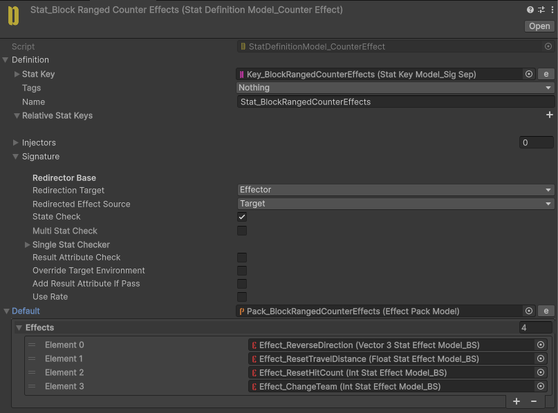

# Thorn Shield

Blocks incoming attacks.

Perfectly timed blocks perform a parry and negate all damage.

Reflects incoming ranged attacks back at enemies.

## Implementation

**Thorn Shield** is a toggle Skill. While it is toggled on, `Pack_WhileToggleOn` applies four Effects: `Effect_ActivateAim`, `Effect_MoveBlock` (the player cannot move while blocking), `Effect_Shield` (raises the **Shielded** flag), and `Effect_Parry` (raises the **Parry** flag for a short `0.4` second window at the start of the block).

### Blocking and parry

While **Shielded**, the **ThornShield_ConditionalAttackDamageModifier** Stat is injected into incoming attack damage to reduce it. It is signature-separated, so each attacker is tracked independently.

During the **Parry** window, the **ThornShield_AttackDamageImmune** Stat grants full immunity, negating all damage and emitting an **Immune** result. The parry also drives skill-specific **CritRate** and **CritMultiplier** conditional modifiers so the counter hit lands critically, and applies `Effect_ParryDamage` back to the attacker.

### Countering attacks

`BlockMeleeCounterEffects` absorbs the CounterEffects carried by received melee attacks while blocking, again signature-separated per attacker.

For ranged attacks, `BlockRangedCounterEffects` runs a set of Effects on the blocked projectile: `Effect_ReverseDirection` flips its travel vector, `Effect_ChangeTeam` switches its team so it now damages enemies, and `Effect_ResetHitCount` / `Effect_ResetTravelDistance` restore its range — sending the shot back the way it came.

When the Skill is toggled off, `Pack_OnToggleOff` syncs the movement and look destination and removes the casting block. A `SkillExtension_BodyPartExtender` script binds the block to a body-part Actor so it originates from the correct bone.
