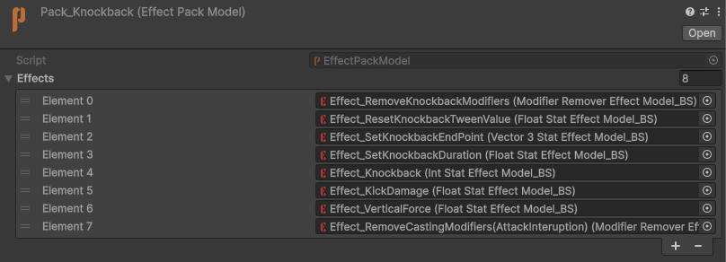
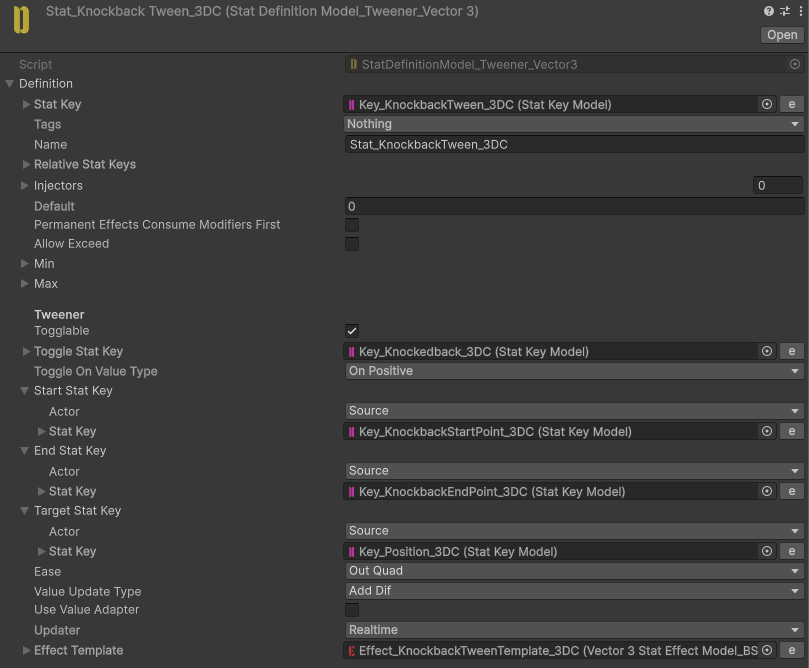
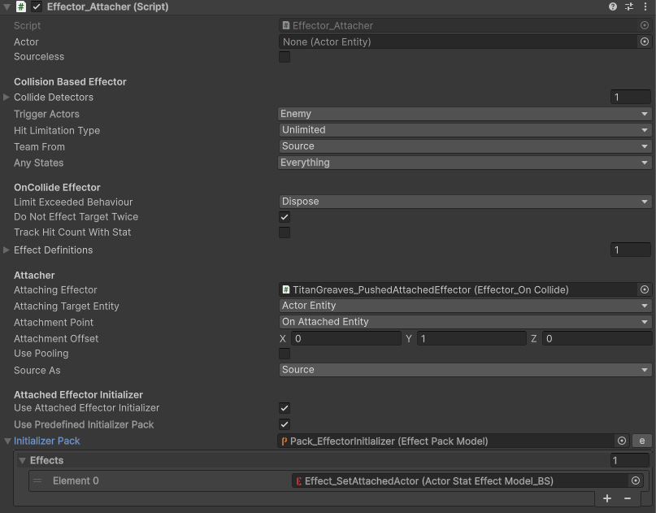
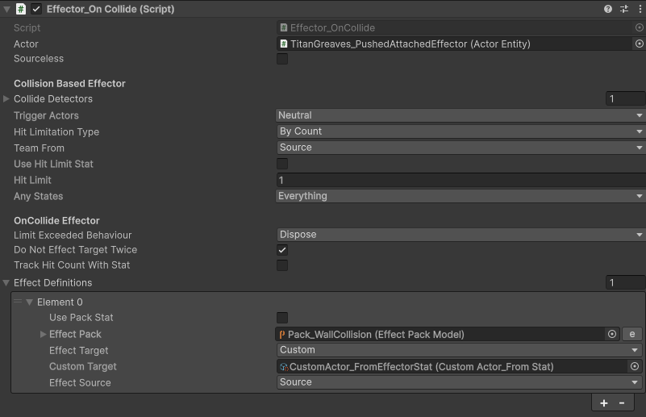

# Titan Greaves

Kicks enemies backward.

Enemies take damage on impact.

Enemies slammed into walls receive additional damage.

## Implementation

On collision, the **Knockback** Pack runs on every hit enemy. `Effect_KickDamage` applies a flat `-3` to **Health**, and `Effect_RemoveCastingModifiers` interrupts whatever the enemy was casting.

The knockback movement is a tween. `Effect_SetKnockbackEndPoint` computes the destination from the kick direction (using `ValueAdapter_Direction` → `ValueAdapter_ProjectOnPlane` → `ValueAdapter_Multiply`), `Effect_SetKnockbackDuration` sets it to `0.75` seconds, `Effect_ResetKnockbackTweenValue` restarts the tween, and `Effect_VerticalForce` adds a small upward pop.

The kick resolves through an **attached Effector**. `Pack_EffectorInitializer` sets the Effector's **AttachedActor** Stat (a `CustomActor_FromStat`), so the knockback Effects always target the specific enemy that was kicked.

While an enemy is being knocked back, the **WallCollision** Pack watches for it colliding with the environment. On a wall hit it applies `Effect_WallCollisionDamage` (an additional `-2` to **Health**) and `Effect_RemoveKnockedbackModifiers` to stop the tween. StatValueAdapters reverse the tween's start and end points so the enemy settles against the wall instead of clipping through it.

