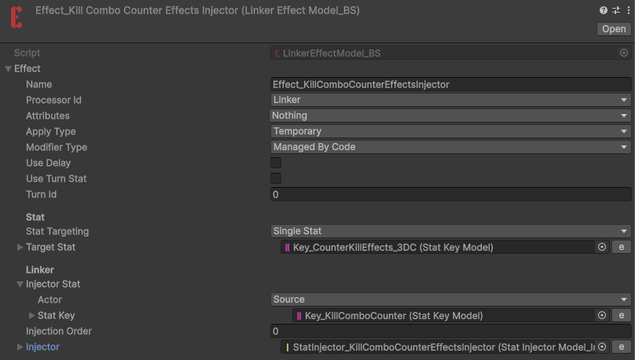
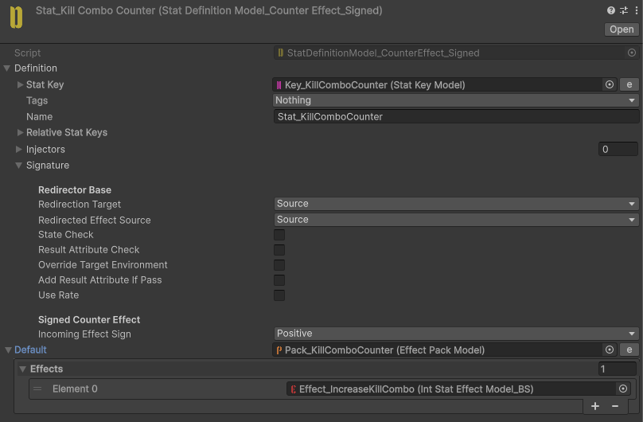
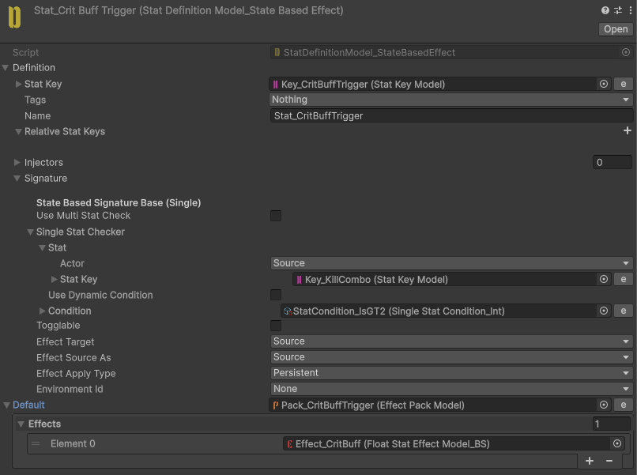

# Twinblade Lance

Defeating two enemies in quick succession empowers the weapon.

While empowered, all attacks become critical hits for **6 seconds**.

## Implementation

**Twinblade Lance** is a three-state combo Skill. Each cast ends with `Effect_IncreaseEvolutionNo`, advancing State 1 → 2 → 3, and the combo resets on the third State's cast end or while mounted. States 1 and 3 add knockback and vertical force, and State 3 re-aims to the pointer input on activation.

To track kills, a `KillComboCounterEffectsInjector` injects a **CounterEffect** into the enemy **Health** Stat that watches for lethal damage dealt by this weapon.

On each kill, `Effect_IncreaseKillCombo` adds `1` to the **KillCombo** Stat as a temporary modifier with a **1.5 second** lifetime. The combo therefore only builds up if the next kill lands quickly.

A `StatCondition_IsGT2` check (**KillCombo** reaching `2`) drives `Key_CritBuffTrigger`. When it is met, `Effect_CritBuff` adds `1` to **CritRate** for **6 seconds**, so every hit is a guaranteed critical while the weapon is empowered.

**TwinbladeLance_CritRate** is the Skill's own crit Attribute Stat, clamped to `0`–`1` and summed by the **CritProcessor**.
