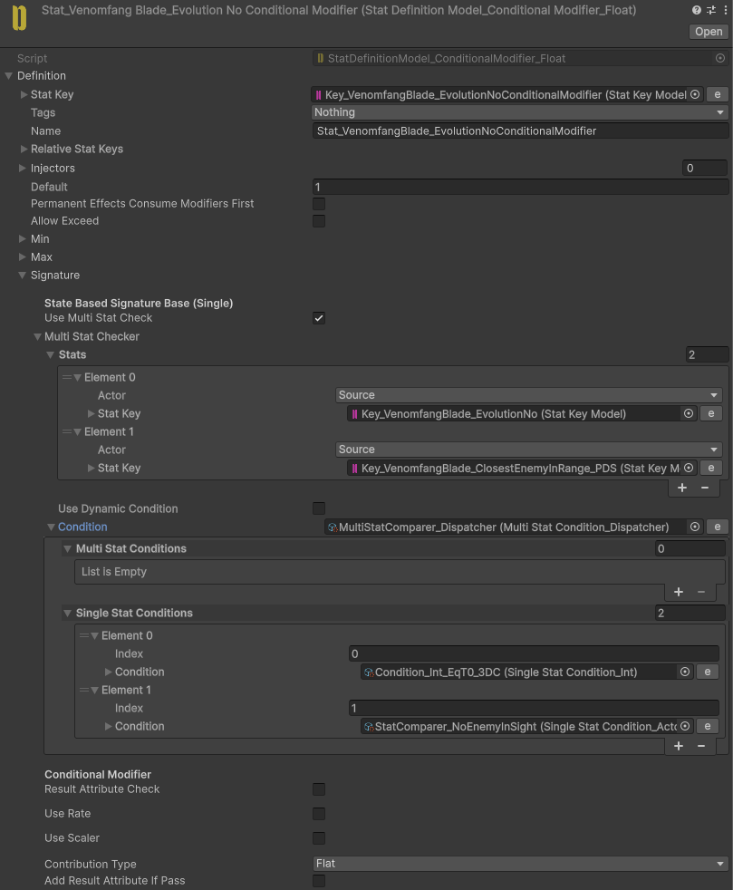
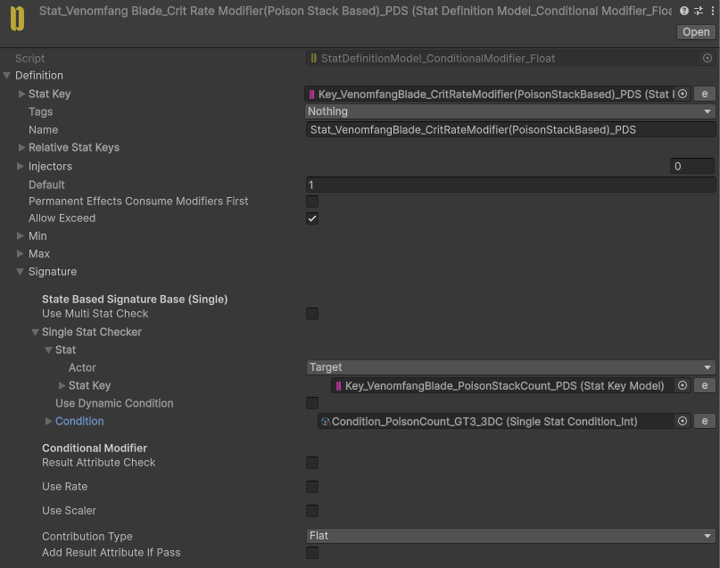

# Venomfang Blade

Blinks to the nearest enemy.

Poisons the target for **4 DPS** over **15 seconds**.

Deals critical hits against heavily poisoned enemies.

## Implementation

**Venomfang Blade** is a three-state Skill: State 1 picks a target, State 2 blinks to it, and State 3 strikes and applies poison.

### Blink

State 1 sets the **ClosestEnemyInSight** Stat using a `CustomActor_ClosestInSight` together with `TargetingFilter_ClosestInSight`. A **DashDecider** ConditionalModifier on **SkillEvolutionNo** then checks `StatComparer_NoEnemyInSight`: if nothing is in sight the blink state is skipped. Otherwise State 2 extracts the enemy's position to a Stat, faces the Actor toward it, and `Effect_Dash` moves the player to that position before syncing position with the destination.

### Poison

The strike in State 3 applies poison to the enemy's own Repository. `Effect_PoisonStackCount` adds `1` to a **PoisonStackCount** Stat (clamped `0`–`10`), and a **PoisonDamageGenerator** Stat produces recurring **Health** damage that works out to roughly **4 DPS**, expiring after about **15 seconds**.

### Critical hits on poisoned targets

**Stat_VenomfangBlade_CritRateModifier(PoisonStackBased)** scales the Skill's **CritRate** with the target's **PoisonStackCount**, so heavily poisoned enemies take critical hits.

A `StatValueAdapter_LookAtIfNotThere` script keeps the Actor facing the target correctly when it has moved out of position.
