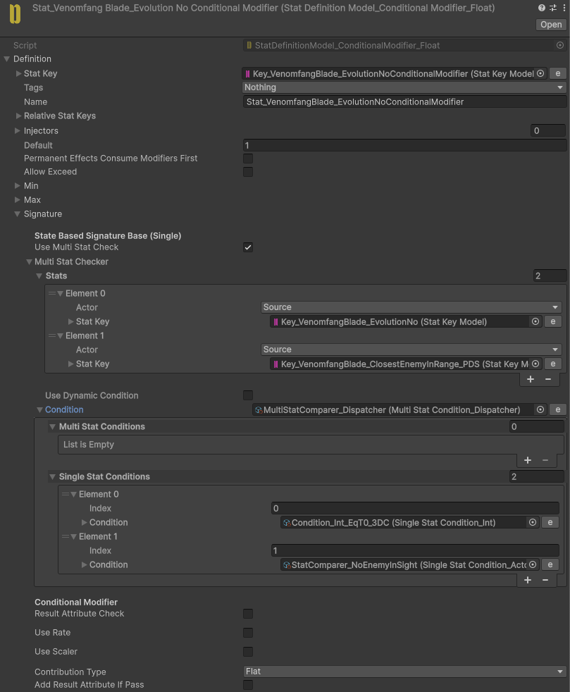

# Venomfang Blade

<video
  autoPlay
  loop
  muted
  playsInline
  controls={false}
  style={{
    width: "100%",
    borderRadius: "12px",
  }}
>
  <source src="/videos/VenomfangBlade.mp4" type="video/mp4" />
</video>

Blinks to the nearest enemy.

Poisons the target for **4 DPS** over **15 seconds**.

Deals critical hits against heavily poisoned enemies.

## Implementation

**Venomfang Blade** is a three-state Skill: State 1 picks a target, State 2 blinks to it, and State 3 strikes and applies poison.

### Blink

State 1 sets the **ClosestEnemyInSight** Stat using a `ClosestInSight` together with `ClosestInSight`. A **DashDecider** ConditionalModifier on **SkillEvolutionNo** then checks `NoEnemyInSight`: if nothing is in sight the blink state is skipped. Otherwise State 2 extracts the enemy's position to a Stat, faces the Actor toward it, and `Dash` moves the player to that position before syncing position with the destination.

### Poison

The strike in State 3 applies poison to the enemy's own Repository. `PoisonStackCount` adds `1` to a **PoisonStackCount** Stat (clamped `0`–`10`), and a **PoisonDamageGenerator** Stat produces recurring **Health** damage that works out to roughly **4 DPS**, expiring after about **15 seconds**.

### Critical hits on poisoned targets

**VenomfangBlade_CritRateModifier(PoisonStackBased)** scales the Skill's **CritRate** with the target's **PoisonStackCount**, so heavily poisoned enemies take critical hits.

<strong>VenomfangBlade_CritRateModifier(PoisonStackBased)</strong> — Stat (ConditionalModifier Float)

<SpecCard kind='stat' label={"Stat (ConditionalModifier Float)"} name='VenomfangBlade_CritRateModifier(PoisonStackBased)'>
  <SpecRow label='Stat Key' icon='key'>{"VenomfangBlade / ConditionalModifier / CritRateModifier_PoisonStackBased"}</SpecRow>
  <SpecRow label={"Default"}>{"1"}</SpecRow>
  <SpecRow label={"Allow Exceed"}>{"true"}</SpecRow>
  <SpecRow label={"Max"}>{"1"}</SpecRow>
  <SpecRow label={"Single Stat Checker \u203a Stat \u203a Actor"}>{"Target"}</SpecRow>
  <SpecRow label={"Single Stat Checker \u203a Condition"}><PowerRef>Condition_GTE3(Int)_3DC</PowerRef></SpecRow>
</SpecCard>

A `LookAtIfNotThere` script keeps the Actor facing the target correctly when it has moved out of position.
